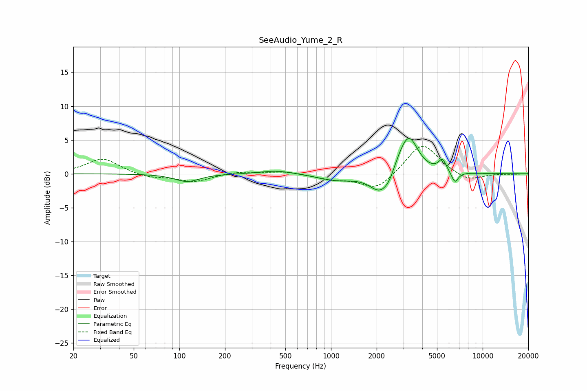

# SeeAudio_Yume_2_R
See [usage instructions](https://github.com/jaakkopasanen/AutoEq#usage) for more options and info.

### Parametric EQs
Apply preamp of -5.3 dB when using parametric equalizer.

|   # | Type    |   Fc (Hz) |    Q |   Gain (dB) |
|-----|---------|-----------|------|-------------|
|   1 | Peaking |       113 | 1.75 |        -1.2 |
|   2 | Peaking |       441 | 1.32 |         0.5 |
|   3 | Peaking |       902 | 1.08 |        -0.2 |
|   4 | Peaking |      1113 | 1.31 |        -0.7 |
|   5 | Peaking |      2130 | 1.99 |        -3.2 |
|   6 | Peaking |      2415 | 4.3  |        -0.8 |
|   7 | Peaking |      2895 | 2.29 |         1.5 |
|   8 | Peaking |      3280 | 2.34 |         5   |
|   9 | Peaking |      5433 | 5.39 |         1.7 |
|  10 | Peaking |      6559 | 6    |        -1.7 |

### Fixed Band EQs
When using fixed band (also called graphic) equalizer, apply preamp of **-4.2 dB** (if available) and set gains manually with these parameters.

|   # | Type    |   Fc (Hz) |    Q |   Gain (dB) |
|-----|---------|-----------|------|-------------|
|   1 | Peaking |        31 | 1.41 |         2.3 |
|   2 | Peaking |        62 | 1.41 |        -0.6 |
|   3 | Peaking |       125 | 1.41 |        -1.2 |
|   4 | Peaking |       250 | 1.41 |         0.4 |
|   5 | Peaking |       500 | 1.41 |         0.4 |
|   6 | Peaking |      1000 | 1.41 |        -0.7 |
|   7 | Peaking |      2000 | 1.41 |        -2.4 |
|   8 | Peaking |      4000 | 1.41 |         4.7 |
|   9 | Peaking |      8000 | 1.41 |        -1.2 |
|  10 | Peaking |     16000 | 1.41 |        -0.1 |

### Graphs

