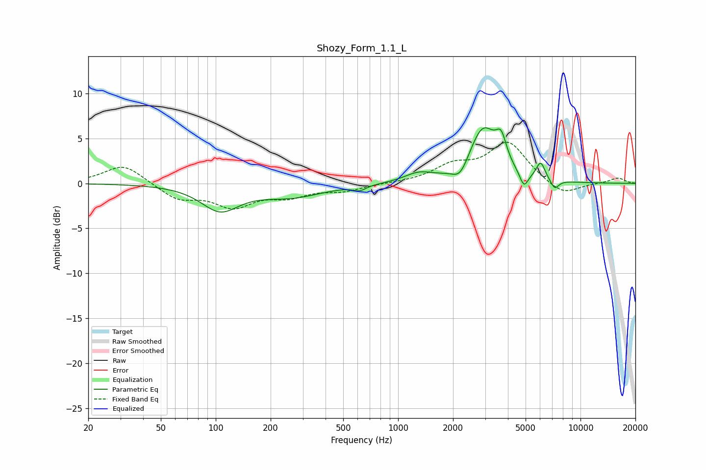

# Shozy_Form_1.1_L
See [usage instructions](https://github.com/jaakkopasanen/AutoEq#usage) for more options and info.

### Parametric EQs
Apply preamp of -6.3 dB when using parametric equalizer.

|   # | Type    |   Fc (Hz) |    Q |   Gain (dB) |
|-----|---------|-----------|------|-------------|
|   1 | Peaking |       106 | 1.37 |        -2.8 |
|   2 | Peaking |       259 | 0.8  |        -1.4 |
|   3 | Peaking |       616 | 4.1  |        -0.5 |
|   4 | Peaking |      1294 | 1.86 |         0.9 |
|   5 | Peaking |      2193 | 3.26 |        -1.7 |
|   6 | Peaking |      2921 | 1.82 |         6   |
|   7 | Peaking |      3674 | 4.85 |         2.7 |
|   8 | Peaking |      4897 | 6    |        -1.7 |
|   9 | Peaking |      6048 | 5.75 |         1.9 |
|  10 | Peaking |      7221 | 6    |        -1.1 |

### Fixed Band EQs
When using fixed band (also called graphic) equalizer, apply preamp of **-4.7 dB** (if available) and set gains manually with these parameters.

|   # | Type    |   Fc (Hz) |    Q |   Gain (dB) |
|-----|---------|-----------|------|-------------|
|   1 | Peaking |        31 | 1.41 |         2.2 |
|   2 | Peaking |        62 | 1.41 |        -1.7 |
|   3 | Peaking |       125 | 1.41 |        -2.4 |
|   4 | Peaking |       250 | 1.41 |        -1.2 |
|   5 | Peaking |       500 | 1.41 |        -0.7 |
|   6 | Peaking |      1000 | 1.41 |         0   |
|   7 | Peaking |      2000 | 1.41 |         1.8 |
|   8 | Peaking |      4000 | 1.41 |         4.5 |
|   9 | Peaking |      8000 | 1.41 |        -1.5 |
|  10 | Peaking |     16000 | 1.41 |         0.6 |

### Graphs

