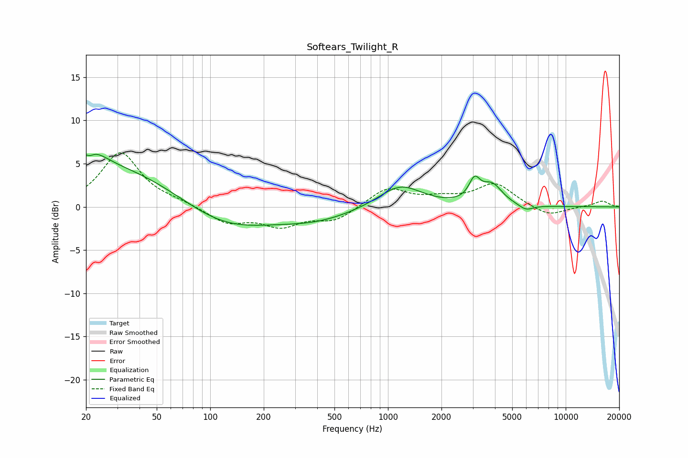

# Softears_Twilight_R
See [usage instructions](https://github.com/jaakkopasanen/AutoEq#usage) for more options and info.

### Parametric EQs
Apply preamp of -6.2 dB when using parametric equalizer.

|   # | Type    |   Fc (Hz) |    Q |   Gain (dB) |
|-----|---------|-----------|------|-------------|
|   1 | Peaking |        21 | 5.67 |         3.3 |
|   2 | Peaking |        21 | 5.91 |        -3.5 |
|   3 | Peaking |        22 | 1.73 |         1.9 |
|   4 | Peaking |        28 | 0.34 |         4.9 |
|   5 | Peaking |       116 | 0.54 |        -3.2 |
|   6 | Peaking |       397 | 0.67 |        -1.3 |
|   7 | Peaking |      1171 | 1.17 |         2.6 |
|   8 | Peaking |      3070 | 4.52 |         2.3 |
|   9 | Peaking |      3851 | 2.44 |         2.3 |
|  10 | Peaking |      5971 | 3.32 |        -0.7 |

### Fixed Band EQs
When using fixed band (also called graphic) equalizer, apply preamp of **-6.4 dB** (if available) and set gains manually with these parameters.

|   # | Type    |   Fc (Hz) |    Q |   Gain (dB) |
|-----|---------|-----------|------|-------------|
|   1 | Peaking |        31 | 1.41 |         6.3 |
|   2 | Peaking |        62 | 1.41 |         0.4 |
|   3 | Peaking |       125 | 1.41 |        -1.8 |
|   4 | Peaking |       250 | 1.41 |        -2   |
|   5 | Peaking |       500 | 1.41 |        -1.5 |
|   6 | Peaking |      1000 | 1.41 |         2.2 |
|   7 | Peaking |      2000 | 1.41 |         0.8 |
|   8 | Peaking |      4000 | 1.41 |         2.6 |
|   9 | Peaking |      8000 | 1.41 |        -1.1 |
|  10 | Peaking |     16000 | 1.41 |         0.7 |

### Graphs

