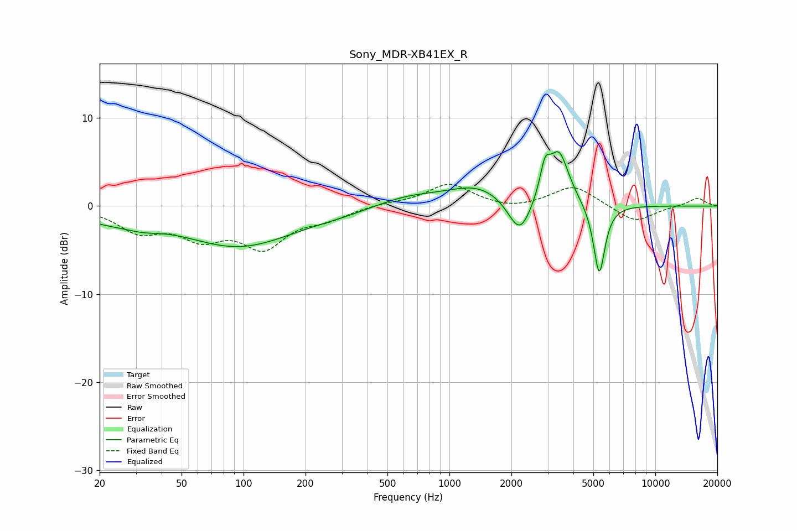

# Sony_MDR-XB41EX_R
See [usage instructions](https://github.com/jaakkopasanen/AutoEq#usage) for more options and info.

### Parametric EQs
Apply preamp of -6.3 dB when using parametric equalizer.

|   # | Type    |   Fc (Hz) |    Q |   Gain (dB) |
|-----|---------|-----------|------|-------------|
|   1 | Peaking |        21 | 0.98 |        -1.2 |
|   2 | Peaking |        32 | 1.65 |        -0.7 |
|   3 | Peaking |        95 | 0.51 |        -4.5 |
|   4 | Peaking |       299 | 1.12 |        -0.3 |
|   5 | Peaking |       631 | 0.92 |         1   |
|   6 | Peaking |      1377 | 0.95 |         2.2 |
|   7 | Peaking |      2195 | 2.48 |        -4.4 |
|   8 | Peaking |      2911 | 5.8  |         3.3 |
|   9 | Peaking |      3401 | 2.86 |         6   |
|  10 | Peaking |      5340 | 5    |        -8.2 |

### Fixed Band EQs
When using fixed band (also called graphic) equalizer, apply preamp of **-2.6 dB** (if available) and set gains manually with these parameters.

|   # | Type    |   Fc (Hz) |    Q |   Gain (dB) |
|-----|---------|-----------|------|-------------|
|   1 | Peaking |        31 | 1.41 |        -2.6 |
|   2 | Peaking |        62 | 1.41 |        -3.1 |
|   3 | Peaking |       125 | 1.41 |        -4.3 |
|   4 | Peaking |       250 | 1.41 |        -1.2 |
|   5 | Peaking |       500 | 1.41 |         0.3 |
|   6 | Peaking |      1000 | 1.41 |         2.5 |
|   7 | Peaking |      2000 | 1.41 |        -0.5 |
|   8 | Peaking |      4000 | 1.41 |         2.3 |
|   9 | Peaking |      8000 | 1.41 |        -1.9 |
|  10 | Peaking |     16000 | 1.41 |         0.9 |

### Graphs

