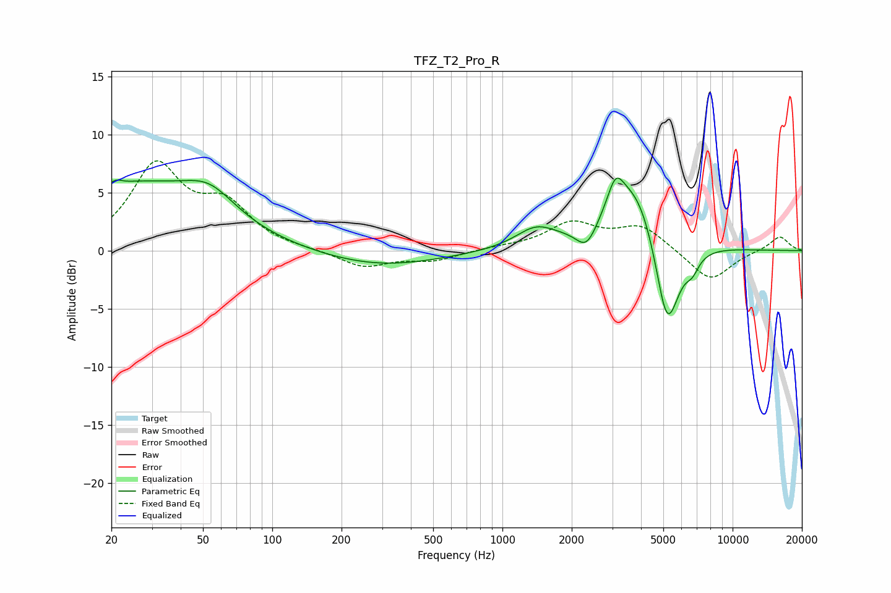

# TFZ_T2_Pro_R
See [usage instructions](https://github.com/jaakkopasanen/AutoEq#usage) for more options and info.

### Parametric EQs
Apply preamp of -6.4 dB when using parametric equalizer.

|   # | Type    |   Fc (Hz) |    Q |   Gain (dB) |
|-----|---------|-----------|------|-------------|
|   1 | Peaking |        21 | 5.72 |         0.4 |
|   2 | Peaking |        25 | 0.44 |         5.5 |
|   3 | Peaking |        53 | 1.25 |         2.3 |
|   4 | Peaking |       292 | 0.53 |        -1.4 |
|   5 | Peaking |      1397 | 1.61 |         1.7 |
|   6 | Peaking |      2321 | 3.11 |        -2.1 |
|   7 | Peaking |      3101 | 4    |         2.5 |
|   8 | Peaking |      3853 | 1.14 |         6.8 |
|   9 | Peaking |      5185 | 2.38 |        -9.6 |
|  10 | Peaking |      6688 | 4.69 |        -1.1 |

### Fixed Band EQs
When using fixed band (also called graphic) equalizer, apply preamp of **-7.8 dB** (if available) and set gains manually with these parameters.

|   # | Type    |   Fc (Hz) |    Q |   Gain (dB) |
|-----|---------|-----------|------|-------------|
|   1 | Peaking |        31 | 1.41 |         7.1 |
|   2 | Peaking |        62 | 1.41 |         3.5 |
|   3 | Peaking |       125 | 1.41 |         0   |
|   4 | Peaking |       250 | 1.41 |        -1.4 |
|   5 | Peaking |       500 | 1.41 |        -0.8 |
|   6 | Peaking |      1000 | 1.41 |         0.2 |
|   7 | Peaking |      2000 | 1.41 |         2.3 |
|   8 | Peaking |      4000 | 1.41 |         2.1 |
|   9 | Peaking |      8000 | 1.41 |        -2.7 |
|  10 | Peaking |     16000 | 1.41 |         1.3 |

### Graphs

