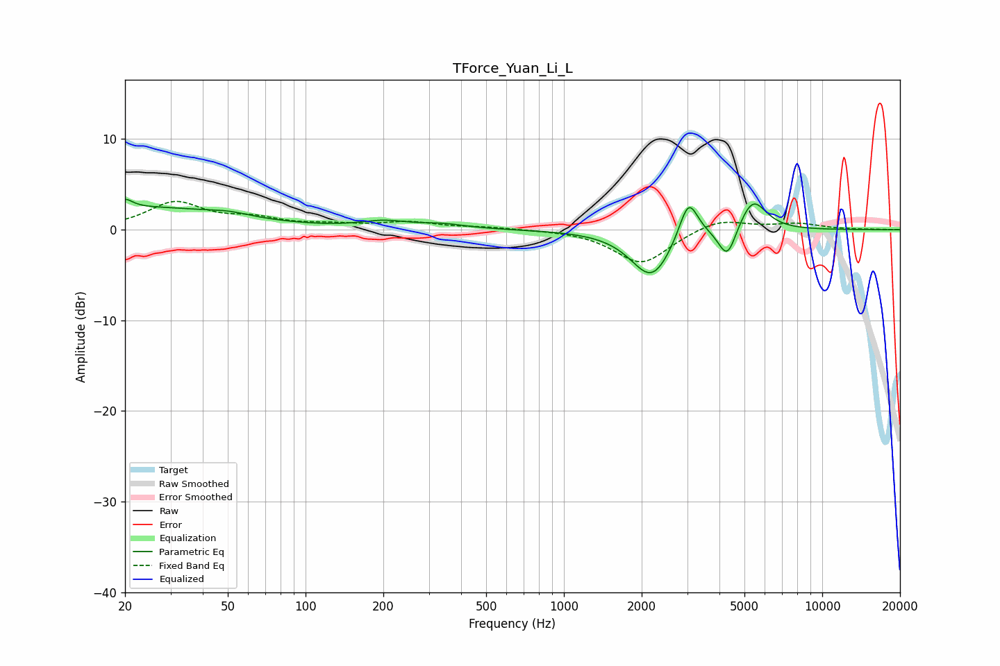

# TForce_Yuan_Li_L
See [usage instructions](https://github.com/jaakkopasanen/AutoEq#usage) for more options and info.

### Parametric EQs
Apply preamp of -3.4 dB when using parametric equalizer.

|   # | Type    |   Fc (Hz) |    Q |   Gain (dB) |
|-----|---------|-----------|------|-------------|
|   1 | Peaking |        20 | 4.94 |         1   |
|   2 | Peaking |        24 | 0.42 |         2.4 |
|   3 | Peaking |        50 | 1.76 |         0.4 |
|   4 | Peaking |       200 | 1.62 |         0.7 |
|   5 | Peaking |       336 | 1.49 |         0.5 |
|   6 | Peaking |      2169 | 1.76 |        -4.9 |
|   7 | Peaking |      2294 | 2.53 |        -0.5 |
|   8 | Peaking |      3037 | 3.8  |         4.6 |
|   9 | Peaking |      4294 | 4.09 |        -3.6 |
|  10 | Peaking |      5380 | 2.63 |         3.7 |

### Fixed Band EQs
When using fixed band (also called graphic) equalizer, apply preamp of **-3.2 dB** (if available) and set gains manually with these parameters.

|   # | Type    |   Fc (Hz) |    Q |   Gain (dB) |
|-----|---------|-----------|------|-------------|
|   1 | Peaking |        31 | 1.41 |         2.9 |
|   2 | Peaking |        62 | 1.41 |         1   |
|   3 | Peaking |       125 | 1.41 |         0.4 |
|   4 | Peaking |       250 | 1.41 |         0.8 |
|   5 | Peaking |       500 | 1.41 |         0.2 |
|   6 | Peaking |      1000 | 1.41 |         0   |
|   7 | Peaking |      2000 | 1.41 |        -3.8 |
|   8 | Peaking |      4000 | 1.41 |         1.3 |
|   9 | Peaking |      8000 | 1.41 |         0.6 |
|  10 | Peaking |     16000 | 1.41 |         0   |

### Graphs

