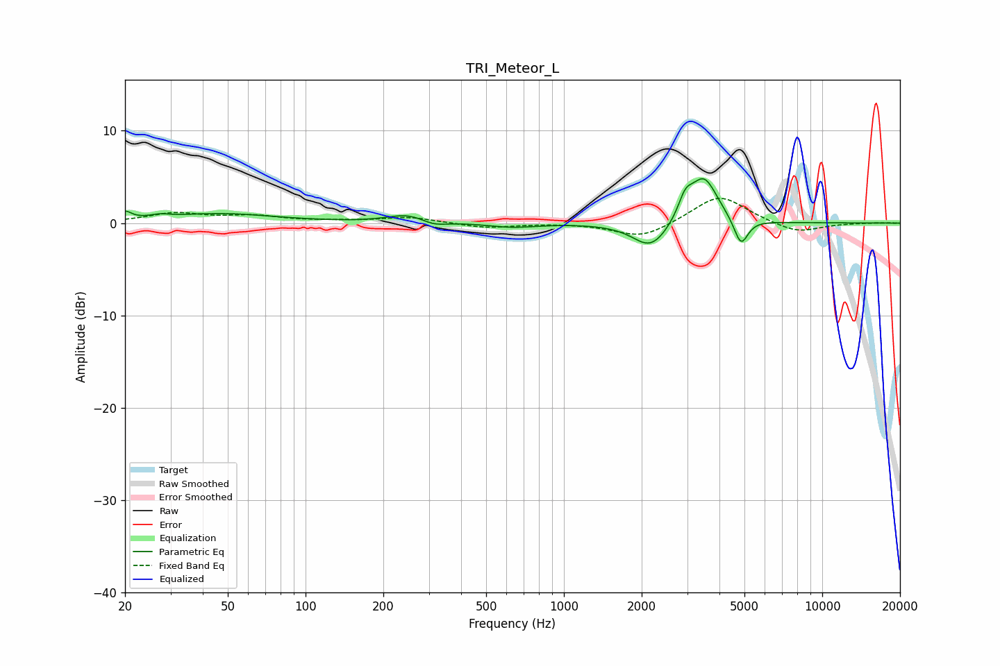

# TRI_Meteor_L
See [usage instructions](https://github.com/jaakkopasanen/AutoEq#usage) for more options and info.

### Parametric EQs
Apply preamp of -4.9 dB when using parametric equalizer.

|   # | Type    |   Fc (Hz) |    Q |   Gain (dB) |
|-----|---------|-----------|------|-------------|
|   1 | Peaking |        20 | 5.83 |         0.9 |
|   2 | Peaking |        27 | 4.09 |         0.3 |
|   3 | Peaking |        47 | 0.66 |         1   |
|   4 | Peaking |       250 | 1.79 |         0.9 |
|   5 | Peaking |       313 | 2.84 |        -0.6 |
|   6 | Peaking |       631 | 1.5  |        -0.5 |
|   7 | Peaking |      2172 | 2.04 |        -2.9 |
|   8 | Peaking |      2951 | 5.15 |         2.1 |
|   9 | Peaking |      3480 | 2.61 |         5   |
|  10 | Peaking |      4846 | 5.19 |        -3   |

### Fixed Band EQs
When using fixed band (also called graphic) equalizer, apply preamp of **-2.8 dB** (if available) and set gains manually with these parameters.

|   # | Type    |   Fc (Hz) |    Q |   Gain (dB) |
|-----|---------|-----------|------|-------------|
|   1 | Peaking |        31 | 1.41 |         1   |
|   2 | Peaking |        62 | 1.41 |         0.7 |
|   3 | Peaking |       125 | 1.41 |         0.1 |
|   4 | Peaking |       250 | 1.41 |         0.6 |
|   5 | Peaking |       500 | 1.41 |        -0.5 |
|   6 | Peaking |      1000 | 1.41 |         0   |
|   7 | Peaking |      2000 | 1.41 |        -1.7 |
|   8 | Peaking |      4000 | 1.41 |         3.1 |
|   9 | Peaking |      8000 | 1.41 |        -1.1 |
|  10 | Peaking |     16000 | 1.41 |         0   |

### Graphs

