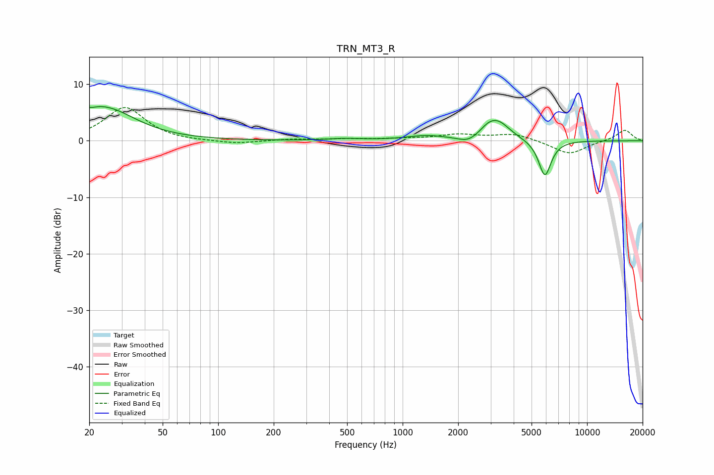

# TRN_MT3_R
See [usage instructions](https://github.com/jaakkopasanen/AutoEq#usage) for more options and info.

### Parametric EQs
Apply preamp of -6.1 dB when using parametric equalizer.

|   # | Type    |   Fc (Hz) |    Q |   Gain (dB) |
|-----|---------|-----------|------|-------------|
|   1 | Peaking |        20 | 1.69 |         1.6 |
|   2 | Peaking |        20 | 5.93 |         3.2 |
|   3 | Peaking |        20 | 6    |        -3.1 |
|   4 | Peaking |        25 | 0.89 |         4.9 |
|   5 | Peaking |       481 | 1.58 |         0.3 |
|   6 | Peaking |      1344 | 1.32 |         0.8 |
|   7 | Peaking |      2259 | 2.79 |        -1   |
|   8 | Peaking |      2896 | 3.38 |         0.9 |
|   9 | Peaking |      3280 | 2.07 |         3.3 |
|  10 | Peaking |      5906 | 3.99 |        -6.4 |

### Fixed Band EQs
When using fixed band (also called graphic) equalizer, apply preamp of **-6.0 dB** (if available) and set gains manually with these parameters.

|   # | Type    |   Fc (Hz) |    Q |   Gain (dB) |
|-----|---------|-----------|------|-------------|
|   1 | Peaking |        31 | 1.41 |         5.9 |
|   2 | Peaking |        62 | 1.41 |        -0.2 |
|   3 | Peaking |       125 | 1.41 |        -0.6 |
|   4 | Peaking |       250 | 1.41 |         0.3 |
|   5 | Peaking |       500 | 1.41 |         0.3 |
|   6 | Peaking |      1000 | 1.41 |         0.3 |
|   7 | Peaking |      2000 | 1.41 |         1   |
|   8 | Peaking |      4000 | 1.41 |         1.2 |
|   9 | Peaking |      8000 | 1.41 |        -2.4 |
|  10 | Peaking |     16000 | 1.41 |         1.9 |

### Graphs

