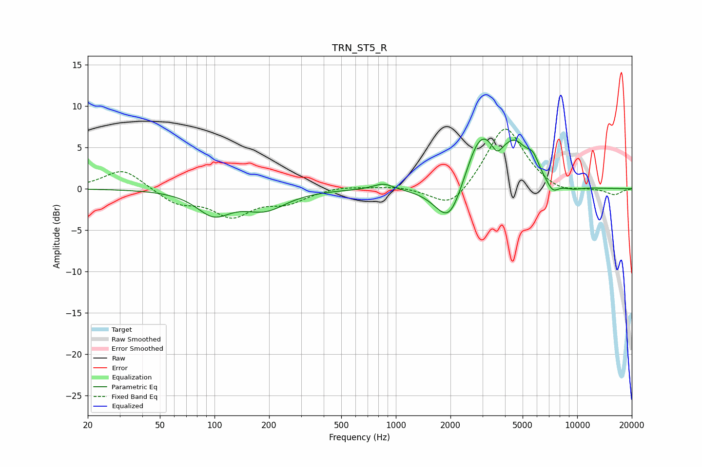

# TRN_ST5_R
See [usage instructions](https://github.com/jaakkopasanen/AutoEq#usage) for more options and info.

### Parametric EQs
Apply preamp of -6.1 dB when using parametric equalizer.

|   # | Type    |   Fc (Hz) |    Q |   Gain (dB) |
|-----|---------|-----------|------|-------------|
|   1 | Peaking |        99 | 1.51 |        -2.8 |
|   2 | Peaking |       190 | 1.2  |        -2.3 |
|   3 | Peaking |       852 | 2.55 |         0.8 |
|   4 | Peaking |      1980 | 1.77 |        -5.6 |
|   5 | Peaking |      2927 | 1.57 |         7   |
|   6 | Peaking |      3612 | 5.13 |        -1.3 |
|   7 | Peaking |      4554 | 1.96 |         4   |
|   8 | Peaking |      5709 | 4.06 |         1.8 |
|   9 | Peaking |      7321 | 3.99 |        -1.3 |
|  10 | Peaking |      9423 | 2.27 |        -0.4 |

### Fixed Band EQs
When using fixed band (also called graphic) equalizer, apply preamp of **-7.3 dB** (if available) and set gains manually with these parameters.

|   # | Type    |   Fc (Hz) |    Q |   Gain (dB) |
|-----|---------|-----------|------|-------------|
|   1 | Peaking |        31 | 1.41 |         2.5 |
|   2 | Peaking |        62 | 1.41 |        -1.7 |
|   3 | Peaking |       125 | 1.41 |        -3.1 |
|   4 | Peaking |       250 | 1.41 |        -1.5 |
|   5 | Peaking |       500 | 1.41 |         0.4 |
|   6 | Peaking |      1000 | 1.41 |         0.3 |
|   7 | Peaking |      2000 | 1.41 |        -2.7 |
|   8 | Peaking |      4000 | 1.41 |         7.8 |
|   9 | Peaking |      8000 | 1.41 |        -0.8 |
|  10 | Peaking |     16000 | 1.41 |        -0.8 |

### Graphs

