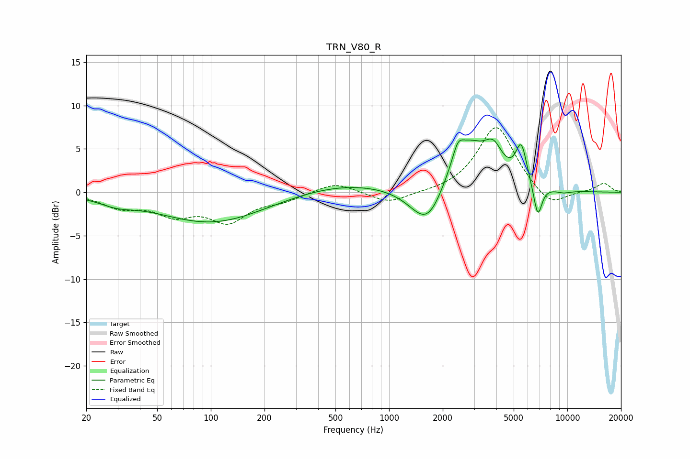

# TRN_V80_R
See [usage instructions](https://github.com/jaakkopasanen/AutoEq#usage) for more options and info.

### Parametric EQs
Apply preamp of -6.2 dB when using parametric equalizer.

|   # | Type    |   Fc (Hz) |    Q |   Gain (dB) |
|-----|---------|-----------|------|-------------|
|   1 | Peaking |        30 | 1.46 |        -0.8 |
|   2 | Peaking |       102 | 0.47 |        -3.5 |
|   3 | Peaking |       571 | 0.48 |         1.2 |
|   4 | Peaking |      1654 | 1.43 |        -5.5 |
|   5 | Peaking |      2428 | 5.13 |         1.6 |
|   6 | Peaking |      2702 | 1.19 |         6.3 |
|   7 | Peaking |      3854 | 2.81 |         2.8 |
|   8 | Peaking |      5517 | 4.43 |         4.3 |
|   9 | Peaking |      6824 | 5.68 |        -3.8 |
|  10 | Peaking |      9489 | 2.74 |        -0.3 |

### Fixed Band EQs
When using fixed band (also called graphic) equalizer, apply preamp of **-7.5 dB** (if available) and set gains manually with these parameters.

|   # | Type    |   Fc (Hz) |    Q |   Gain (dB) |
|-----|---------|-----------|------|-------------|
|   1 | Peaking |        31 | 1.41 |        -1.5 |
|   2 | Peaking |        62 | 1.41 |        -2.2 |
|   3 | Peaking |       125 | 1.41 |        -3.1 |
|   4 | Peaking |       250 | 1.41 |        -0.8 |
|   5 | Peaking |       500 | 1.41 |         1.2 |
|   6 | Peaking |      1000 | 1.41 |        -1.3 |
|   7 | Peaking |      2000 | 1.41 |        -0.1 |
|   8 | Peaking |      4000 | 1.41 |         7.8 |
|   9 | Peaking |      8000 | 1.41 |        -2   |
|  10 | Peaking |     16000 | 1.41 |         1   |

### Graphs

