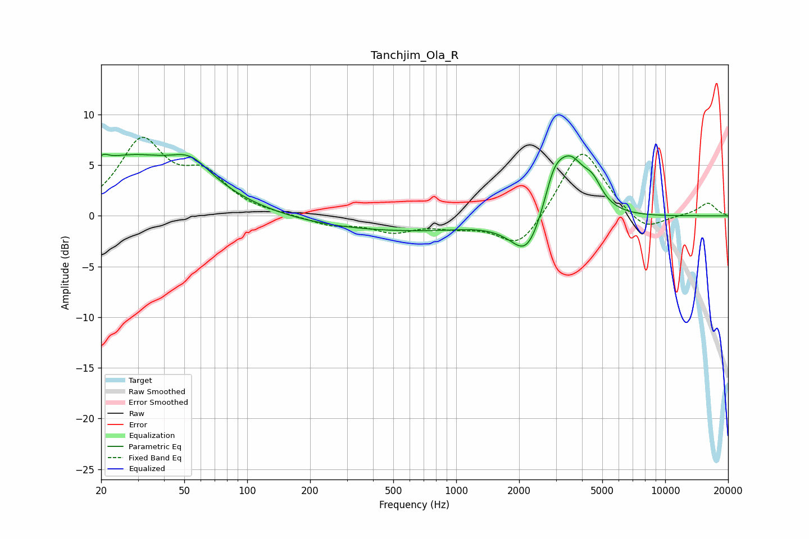

# Tanchjim_Ola_R
See [usage instructions](https://github.com/jaakkopasanen/AutoEq#usage) for more options and info.

### Parametric EQs
Apply preamp of -6.2 dB when using parametric equalizer.

|   # | Type    |   Fc (Hz) |    Q |   Gain (dB) |
|-----|---------|-----------|------|-------------|
|   1 | Peaking |        20 | 5.69 |         0.6 |
|   2 | Peaking |        28 | 0.45 |         5.9 |
|   3 | Peaking |        42 | 1.1  |        -0.5 |
|   4 | Peaking |        54 | 1.51 |         2.1 |
|   5 | Peaking |       807 | 0.18 |        -1.6 |
|   6 | Peaking |      1293 | 1.02 |         0.4 |
|   7 | Peaking |      2181 | 1.95 |        -3.7 |
|   8 | Peaking |      2925 | 3.16 |         2.8 |
|   9 | Peaking |      3494 | 1.75 |         6.1 |
|  10 | Peaking |      4511 | 3.22 |         1.8 |

### Fixed Band EQs
When using fixed band (also called graphic) equalizer, apply preamp of **-7.8 dB** (if available) and set gains manually with these parameters.

|   # | Type    |   Fc (Hz) |    Q |   Gain (dB) |
|-----|---------|-----------|------|-------------|
|   1 | Peaking |        31 | 1.41 |         7.1 |
|   2 | Peaking |        62 | 1.41 |         3.5 |
|   3 | Peaking |       125 | 1.41 |         0.1 |
|   4 | Peaking |       250 | 1.41 |        -0.9 |
|   5 | Peaking |       500 | 1.41 |        -1.4 |
|   6 | Peaking |      1000 | 1.41 |        -0.8 |
|   7 | Peaking |      2000 | 1.41 |        -3.4 |
|   8 | Peaking |      4000 | 1.41 |         6.9 |
|   9 | Peaking |      8000 | 1.41 |        -1.8 |
|  10 | Peaking |     16000 | 1.41 |         1.3 |

### Graphs

