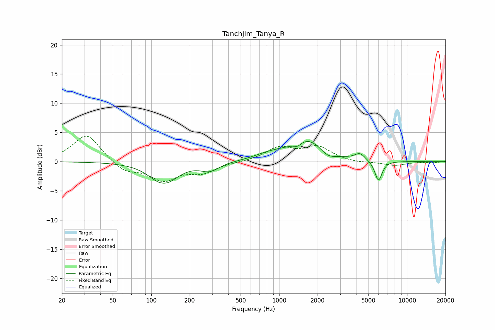

# Tanchjim_Tanya_R
See [usage instructions](https://github.com/jaakkopasanen/AutoEq#usage) for more options and info.

### Parametric EQs
Apply preamp of -3.5 dB when using parametric equalizer.

|   # | Type    |   Fc (Hz) |    Q |   Gain (dB) |
|-----|---------|-----------|------|-------------|
|   1 | Peaking |       124 | 3.4  |         0.3 |
|   2 | Peaking |       125 | 1.41 |        -4   |
|   3 | Peaking |       288 | 1.98 |        -1.4 |
|   4 | Peaking |       816 | 1.27 |         0.9 |
|   5 | Peaking |      1030 | 2.08 |         0.2 |
|   6 | Peaking |      1395 | 5.14 |        -0.7 |
|   7 | Peaking |      1701 | 1.06 |         3.8 |
|   8 | Peaking |      2396 | 2.23 |        -1.3 |
|   9 | Peaking |      4287 | 3.53 |         1.1 |
|  10 | Peaking |      5983 | 4.83 |        -3.5 |

### Fixed Band EQs
When using fixed band (also called graphic) equalizer, apply preamp of **-4.5 dB** (if available) and set gains manually with these parameters.

|   # | Type    |   Fc (Hz) |    Q |   Gain (dB) |
|-----|---------|-----------|------|-------------|
|   1 | Peaking |        31 | 1.41 |         4.8 |
|   2 | Peaking |        62 | 1.41 |        -1.8 |
|   3 | Peaking |       125 | 1.41 |        -3   |
|   4 | Peaking |       250 | 1.41 |        -1.7 |
|   5 | Peaking |       500 | 1.41 |        -0   |
|   6 | Peaking |      1000 | 1.41 |         2.3 |
|   7 | Peaking |      2000 | 1.41 |         2.4 |
|   8 | Peaking |      4000 | 1.41 |        -0.3 |
|   9 | Peaking |      8000 | 1.41 |        -0.7 |
|  10 | Peaking |     16000 | 1.41 |        -0.2 |

### Graphs

