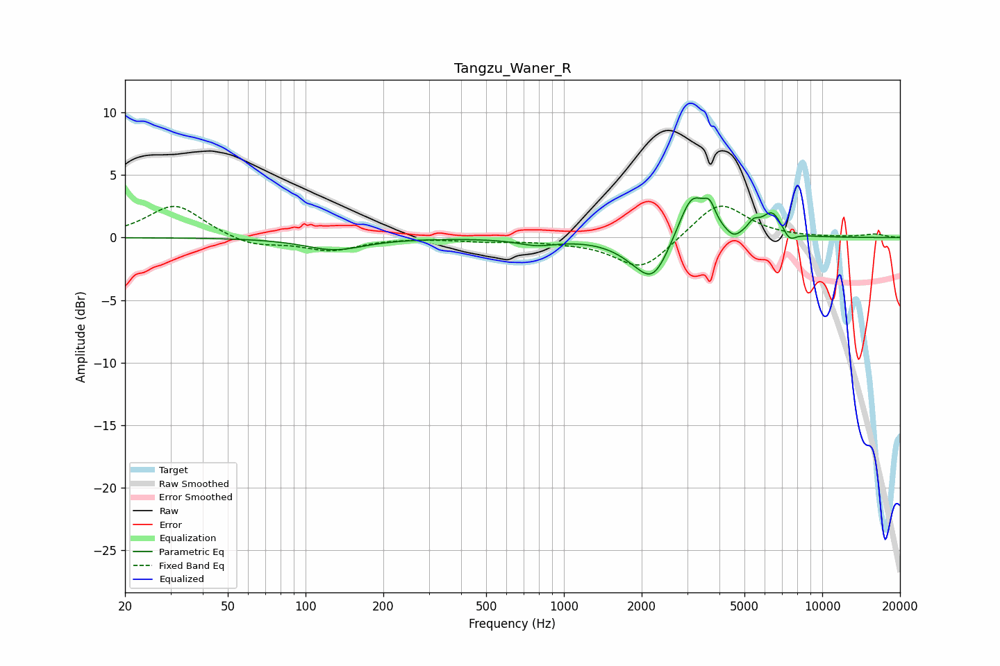

# Tangzu_Waner_R
See [usage instructions](https://github.com/jaakkopasanen/AutoEq#usage) for more options and info.

### Parametric EQs
Apply preamp of -3.3 dB when using parametric equalizer.

|   # | Type    |   Fc (Hz) |    Q |   Gain (dB) |
|-----|---------|-----------|------|-------------|
|   1 | Peaking |       129 | 1.24 |        -1   |
|   2 | Peaking |       785 | 1.89 |        -0.5 |
|   3 | Peaking |      1921 | 1.7  |        -0.9 |
|   4 | Peaking |      2225 | 2.28 |        -2.9 |
|   5 | Peaking |      3128 | 2.67 |         3.7 |
|   6 | Peaking |      3666 | 6    |         1.5 |
|   7 | Peaking |      4544 | 4.76 |        -0.6 |
|   8 | Peaking |      5422 | 6    |         0.8 |
|   9 | Peaking |      6398 | 3.45 |         1.9 |
|  10 | Peaking |      7463 | 5.44 |        -0.8 |

### Fixed Band EQs
When using fixed band (also called graphic) equalizer, apply preamp of **-2.6 dB** (if available) and set gains manually with these parameters.

|   # | Type    |   Fc (Hz) |    Q |   Gain (dB) |
|-----|---------|-----------|------|-------------|
|   1 | Peaking |        31 | 1.41 |         2.7 |
|   2 | Peaking |        62 | 1.41 |        -0.7 |
|   3 | Peaking |       125 | 1.41 |        -1   |
|   4 | Peaking |       250 | 1.41 |         0   |
|   5 | Peaking |       500 | 1.41 |        -0.2 |
|   6 | Peaking |      1000 | 1.41 |        -0.2 |
|   7 | Peaking |      2000 | 1.41 |        -2.6 |
|   8 | Peaking |      4000 | 1.41 |         3   |
|   9 | Peaking |      8000 | 1.41 |        -0   |
|  10 | Peaking |     16000 | 1.41 |         0.3 |

### Graphs

