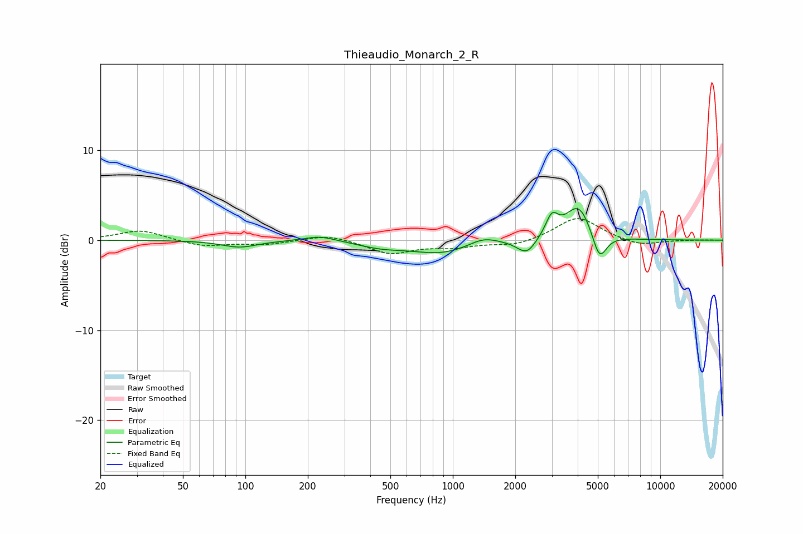

# Thieaudio_Monarch_2_R
See [usage instructions](https://github.com/jaakkopasanen/AutoEq#usage) for more options and info.

### Parametric EQs
Apply preamp of -3.6 dB when using parametric equalizer.

|   # | Type    |   Fc (Hz) |    Q |   Gain (dB) |
|-----|---------|-----------|------|-------------|
|   1 | Peaking |        94 | 1.65 |        -0.8 |
|   2 | Peaking |       228 | 1.87 |         0.6 |
|   3 | Peaking |       450 | 1.33 |        -0.6 |
|   4 | Peaking |       880 | 0.93 |        -1.4 |
|   5 | Peaking |      1399 | 2.03 |         0.8 |
|   6 | Peaking |      2144 | 2.96 |        -0.5 |
|   7 | Peaking |      2301 | 3.49 |        -1.3 |
|   8 | Peaking |      3005 | 4.76 |         2.2 |
|   9 | Peaking |      4045 | 2.19 |         4   |
|  10 | Peaking |      5086 | 3.98 |        -3.3 |

### Fixed Band EQs
When using fixed band (also called graphic) equalizer, apply preamp of **-2.5 dB** (if available) and set gains manually with these parameters.

|   # | Type    |   Fc (Hz) |    Q |   Gain (dB) |
|-----|---------|-----------|------|-------------|
|   1 | Peaking |        31 | 1.41 |         1.1 |
|   2 | Peaking |        62 | 1.41 |        -0.7 |
|   3 | Peaking |       125 | 1.41 |        -0.5 |
|   4 | Peaking |       250 | 1.41 |         0.7 |
|   5 | Peaking |       500 | 1.41 |        -1.5 |
|   6 | Peaking |      1000 | 1.41 |        -0.7 |
|   7 | Peaking |      2000 | 1.41 |        -0.6 |
|   8 | Peaking |      4000 | 1.41 |         2.6 |
|   9 | Peaking |      8000 | 1.41 |        -0.7 |
|  10 | Peaking |     16000 | 1.41 |         0   |

### Graphs

