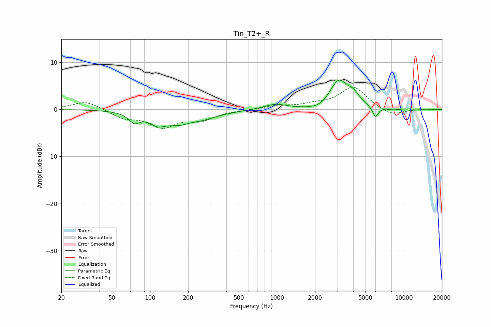

# Tin_T2+_R
See [usage instructions](https://github.com/jaakkopasanen/AutoEq#usage) for more options and info.

### Parametric EQs
Apply preamp of -6.3 dB when using parametric equalizer.

|   # | Type    |   Fc (Hz) |    Q |   Gain (dB) |
|-----|---------|-----------|------|-------------|
|   1 | Peaking |        75 | 3.26 |        -2   |
|   2 | Peaking |       114 | 2.37 |        -1.8 |
|   3 | Peaking |       193 | 0.94 |        -4   |
|   4 | Peaking |       208 | 1.89 |         1.2 |
|   5 | Peaking |       973 | 1.59 |         1.1 |
|   6 | Peaking |      2249 | 1.52 |        -1.2 |
|   7 | Peaking |      3065 | 1.83 |         6.4 |
|   8 | Peaking |      4049 | 3.13 |         1.7 |
|   9 | Peaking |      5983 | 5.97 |        -2.3 |
|  10 | Peaking |      8225 | 3.14 |        -0.3 |

### Fixed Band EQs
When using fixed band (also called graphic) equalizer, apply preamp of **-4.8 dB** (if available) and set gains manually with these parameters.

|   # | Type    |   Fc (Hz) |    Q |   Gain (dB) |
|-----|---------|-----------|------|-------------|
|   1 | Peaking |        31 | 1.41 |         1.8 |
|   2 | Peaking |        62 | 1.41 |        -1.7 |
|   3 | Peaking |       125 | 1.41 |        -3.5 |
|   4 | Peaking |       250 | 1.41 |        -2   |
|   5 | Peaking |       500 | 1.41 |        -0.1 |
|   6 | Peaking |      1000 | 1.41 |         0.7 |
|   7 | Peaking |      2000 | 1.41 |         0.8 |
|   8 | Peaking |      4000 | 1.41 |         4.8 |
|   9 | Peaking |      8000 | 1.41 |        -1.5 |
|  10 | Peaking |     16000 | 1.41 |        -0.1 |

### Graphs

