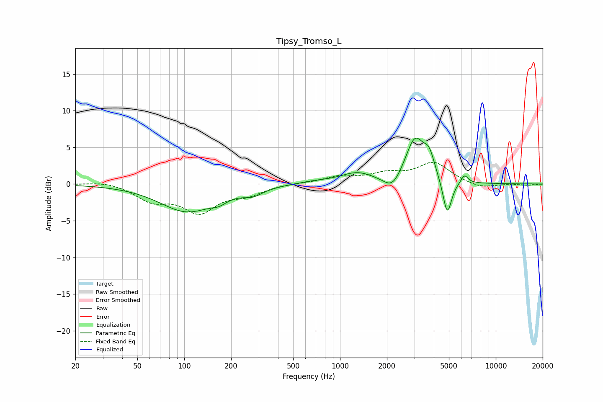

# Tipsy_Tromso_L
See [usage instructions](https://github.com/jaakkopasanen/AutoEq#usage) for more options and info.

### Parametric EQs
Apply preamp of -6.4 dB when using parametric equalizer.

|   # | Type    |   Fc (Hz) |    Q |   Gain (dB) |
|-----|---------|-----------|------|-------------|
|   1 | Peaking |       104 | 0.81 |        -3.7 |
|   2 | Peaking |       167 | 2.81 |        -0.7 |
|   3 | Peaking |       276 | 2.19 |        -0.9 |
|   4 | Peaking |       680 | 1.36 |         0.3 |
|   5 | Peaking |      1285 | 1.33 |         1.4 |
|   6 | Peaking |      2168 | 2.53 |        -2   |
|   7 | Peaking |      3029 | 2.27 |         6.1 |
|   8 | Peaking |      3741 | 4.05 |         2.6 |
|   9 | Peaking |      4878 | 4.91 |        -5   |
|  10 | Peaking |      6291 | 6    |         1.2 |

### Fixed Band EQs
When using fixed band (also called graphic) equalizer, apply preamp of **-3.1 dB** (if available) and set gains manually with these parameters.

|   # | Type    |   Fc (Hz) |    Q |   Gain (dB) |
|-----|---------|-----------|------|-------------|
|   1 | Peaking |        31 | 1.41 |         0.4 |
|   2 | Peaking |        62 | 1.41 |        -2.1 |
|   3 | Peaking |       125 | 1.41 |        -3.6 |
|   4 | Peaking |       250 | 1.41 |        -1.2 |
|   5 | Peaking |       500 | 1.41 |         0.1 |
|   6 | Peaking |      1000 | 1.41 |         0.9 |
|   7 | Peaking |      2000 | 1.41 |         1.2 |
|   8 | Peaking |      4000 | 1.41 |         2.8 |
|   9 | Peaking |      8000 | 1.41 |        -0.7 |
|  10 | Peaking |     16000 | 1.41 |        -0.2 |

### Graphs

