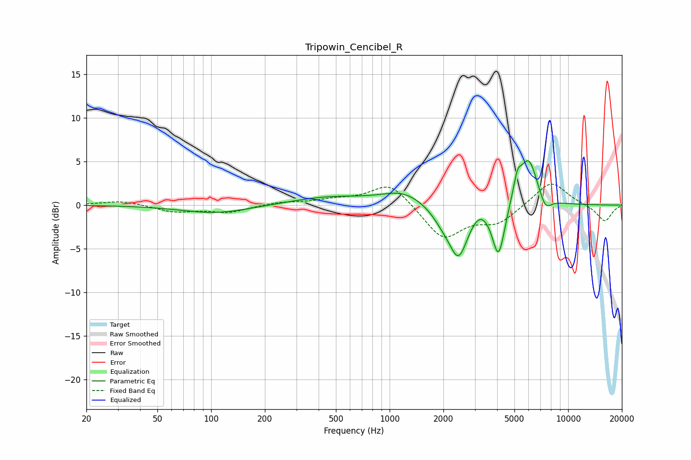

# Tripowin_Cencibel_R
See [usage instructions](https://github.com/jaakkopasanen/AutoEq#usage) for more options and info.

### Parametric EQs
Apply preamp of -5.2 dB when using parametric equalizer.

|   # | Type    |   Fc (Hz) |    Q |   Gain (dB) |
|-----|---------|-----------|------|-------------|
|   1 | Peaking |       106 | 0.74 |        -1   |
|   2 | Peaking |       462 | 0.65 |         0.9 |
|   3 | Peaking |      1191 | 1.19 |         1.5 |
|   4 | Peaking |      1993 | 2.26 |        -1.4 |
|   5 | Peaking |      2432 | 2.69 |        -5.5 |
|   6 | Peaking |      3191 | 3.24 |         0.8 |
|   7 | Peaking |      4074 | 4.04 |        -6   |
|   8 | Peaking |      5194 | 5.95 |         2.4 |
|   9 | Peaking |      6001 | 2.73 |         5.4 |
|  10 | Peaking |      7459 | 4.12 |        -1.6 |

### Fixed Band EQs
When using fixed band (also called graphic) equalizer, apply preamp of **-2.5 dB** (if available) and set gains manually with these parameters.

|   # | Type    |   Fc (Hz) |    Q |   Gain (dB) |
|-----|---------|-----------|------|-------------|
|   1 | Peaking |        31 | 1.41 |         0.5 |
|   2 | Peaking |        62 | 1.41 |        -0.8 |
|   3 | Peaking |       125 | 1.41 |        -0.8 |
|   4 | Peaking |       250 | 1.41 |         0.3 |
|   5 | Peaking |       500 | 1.41 |         0.5 |
|   6 | Peaking |      1000 | 1.41 |         2.7 |
|   7 | Peaking |      2000 | 1.41 |        -3.9 |
|   8 | Peaking |      4000 | 1.41 |        -1.9 |
|   9 | Peaking |      8000 | 1.41 |         2.9 |
|  10 | Peaking |     16000 | 1.41 |        -1.9 |

### Graphs

