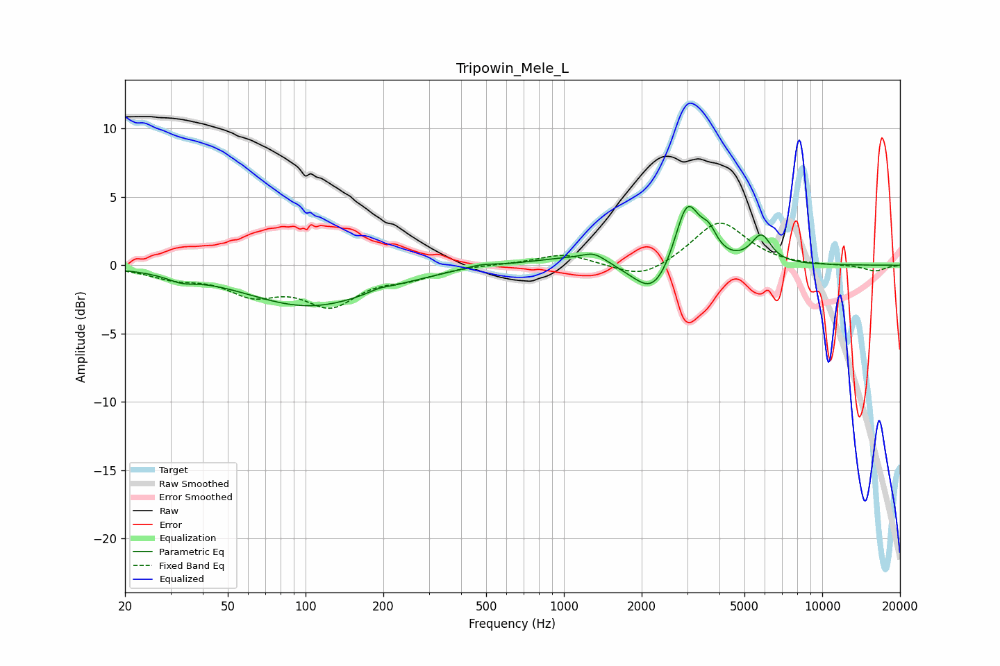

# Tripowin_Mele_L
See [usage instructions](https://github.com/jaakkopasanen/AutoEq#usage) for more options and info.

### Parametric EQs
Apply preamp of -4.4 dB when using parametric equalizer.

|   # | Type    |   Fc (Hz) |    Q |   Gain (dB) |
|-----|---------|-----------|------|-------------|
|   1 | Peaking |        33 | 2.59 |        -0.5 |
|   2 | Peaking |       104 | 0.56 |        -3   |
|   3 | Peaking |       192 | 3.82 |         0.2 |
|   4 | Peaking |       474 | 2.16 |         0.3 |
|   5 | Peaking |      1060 | 0.88 |         0.6 |
|   6 | Peaking |      1309 | 3.03 |         0.6 |
|   7 | Peaking |      2225 | 1.8  |        -2.7 |
|   8 | Peaking |      2997 | 2.91 |         4.9 |
|   9 | Peaking |      3646 | 4.44 |         1.4 |
|  10 | Peaking |      5807 | 3.6  |         2   |

### Fixed Band EQs
When using fixed band (also called graphic) equalizer, apply preamp of **-3.2 dB** (if available) and set gains manually with these parameters.

|   # | Type    |   Fc (Hz) |    Q |   Gain (dB) |
|-----|---------|-----------|------|-------------|
|   1 | Peaking |        31 | 1.41 |        -0.8 |
|   2 | Peaking |        62 | 1.41 |        -1.8 |
|   3 | Peaking |       125 | 1.41 |        -2.7 |
|   4 | Peaking |       250 | 1.41 |        -0.7 |
|   5 | Peaking |       500 | 1.41 |         0.1 |
|   6 | Peaking |      1000 | 1.41 |         0.8 |
|   7 | Peaking |      2000 | 1.41 |        -1.1 |
|   8 | Peaking |      4000 | 1.41 |         3.3 |
|   9 | Peaking |      8000 | 1.41 |        -0.1 |
|  10 | Peaking |     16000 | 1.41 |        -0.4 |

### Graphs

