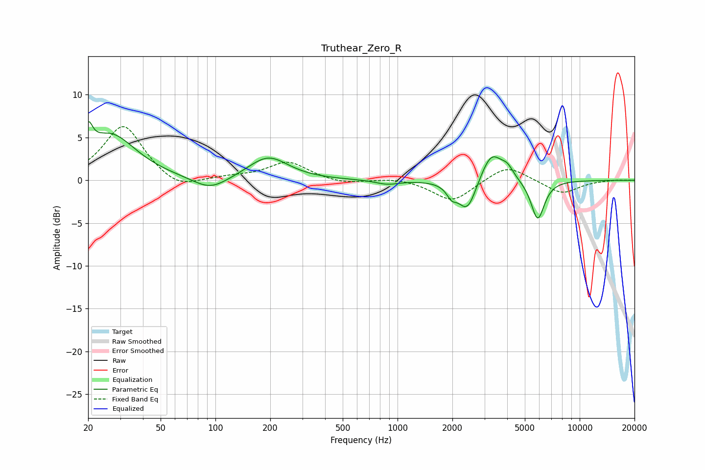

# Truthear_Zero_R
See [usage instructions](https://github.com/jaakkopasanen/AutoEq#usage) for more options and info.

### Parametric EQs
Apply preamp of -6.9 dB when using parametric equalizer.

|   # | Type    |   Fc (Hz) |    Q |   Gain (dB) |
|-----|---------|-----------|------|-------------|
|   1 | Peaking |        20 | 5.95 |         3   |
|   2 | Peaking |        27 | 1.02 |         5.3 |
|   3 | Peaking |        94 | 1.47 |        -1.6 |
|   4 | Peaking |       195 | 1.29 |         2.7 |
|   5 | Peaking |       879 | 2.2  |        -0.5 |
|   6 | Peaking |      1981 | 5.19 |        -1.2 |
|   7 | Peaking |      2417 | 2.8  |        -3.8 |
|   8 | Peaking |      3277 | 2.35 |         3.6 |
|   9 | Peaking |      4011 | 4.33 |         1   |
|  10 | Peaking |      5881 | 3.73 |        -4.7 |

### Fixed Band EQs
When using fixed band (also called graphic) equalizer, apply preamp of **-6.4 dB** (if available) and set gains manually with these parameters.

|   # | Type    |   Fc (Hz) |    Q |   Gain (dB) |
|-----|---------|-----------|------|-------------|
|   1 | Peaking |        31 | 1.41 |         6.5 |
|   2 | Peaking |        62 | 1.41 |        -1.4 |
|   3 | Peaking |       125 | 1.41 |         0.3 |
|   4 | Peaking |       250 | 1.41 |         2.1 |
|   5 | Peaking |       500 | 1.41 |        -0.5 |
|   6 | Peaking |      1000 | 1.41 |         0.3 |
|   7 | Peaking |      2000 | 1.41 |        -2.5 |
|   8 | Peaking |      4000 | 1.41 |         1.9 |
|   9 | Peaking |      8000 | 1.41 |        -1.6 |
|  10 | Peaking |     16000 | 1.41 |         0.1 |

### Graphs

