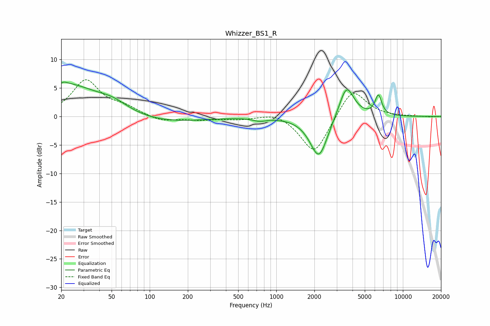

# Whizzer_BS1_R
See [usage instructions](https://github.com/jaakkopasanen/AutoEq#usage) for more options and info.

### Parametric EQs
Apply preamp of -6.1 dB when using parametric equalizer.

|   # | Type    |   Fc (Hz) |    Q |   Gain (dB) |
|-----|---------|-----------|------|-------------|
|   1 | Peaking |        20 | 0.47 |         5.9 |
|   2 | Peaking |        20 | 5.97 |        -3.2 |
|   3 | Peaking |        20 | 5.93 |         3.2 |
|   4 | Peaking |        52 | 1.26 |         1.2 |
|   5 | Peaking |       118 | 0.46 |        -1.2 |
|   6 | Peaking |       738 | 2.8  |        -0.5 |
|   7 | Peaking |      2113 | 1.68 |        -0.9 |
|   8 | Peaking |      2174 | 2.09 |        -6.5 |
|   9 | Peaking |      3586 | 2.37 |         5.9 |
|  10 | Peaking |      6403 | 5.23 |         3.5 |

### Fixed Band EQs
When using fixed band (also called graphic) equalizer, apply preamp of **-6.5 dB** (if available) and set gains manually with these parameters.

|   # | Type    |   Fc (Hz) |    Q |   Gain (dB) |
|-----|---------|-----------|------|-------------|
|   1 | Peaking |        31 | 1.41 |         6.2 |
|   2 | Peaking |        62 | 1.41 |         1.4 |
|   3 | Peaking |       125 | 1.41 |        -0.9 |
|   4 | Peaking |       250 | 1.41 |        -0.5 |
|   5 | Peaking |       500 | 1.41 |        -0.4 |
|   6 | Peaking |      1000 | 1.41 |         0.9 |
|   7 | Peaking |      2000 | 1.41 |        -6.8 |
|   8 | Peaking |      4000 | 1.41 |         5.2 |
|   9 | Peaking |      8000 | 1.41 |         0   |
|  10 | Peaking |     16000 | 1.41 |        -0.1 |

### Graphs

