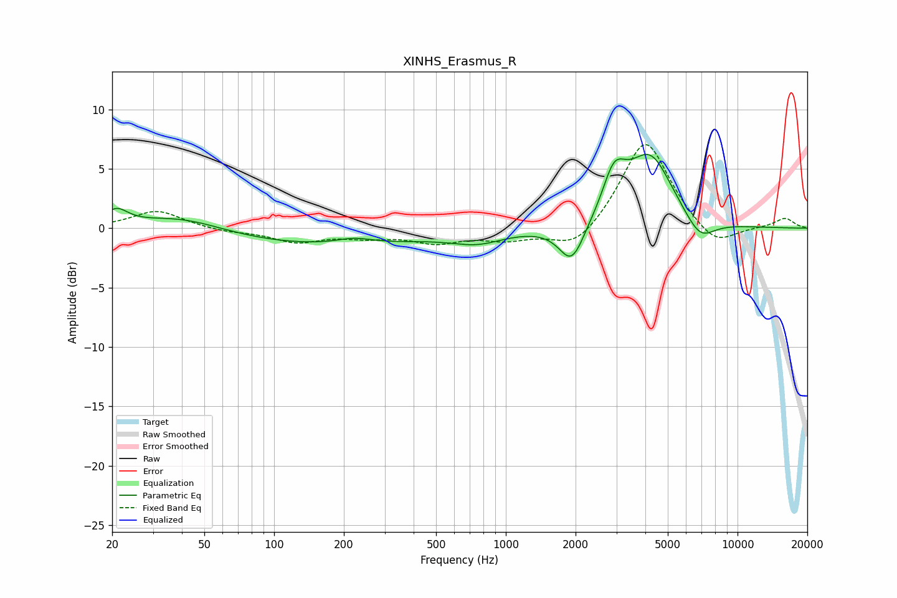

# XINHS_Erasmus_R
See [usage instructions](https://github.com/jaakkopasanen/AutoEq#usage) for more options and info.

### Parametric EQs
Apply preamp of -6.3 dB when using parametric equalizer.

|   # | Type    |   Fc (Hz) |    Q |   Gain (dB) |
|-----|---------|-----------|------|-------------|
|   1 | Peaking |        21 | 2.9  |         1.3 |
|   2 | Peaking |        40 | 0.76 |         1.3 |
|   3 | Peaking |       158 | 0.31 |        -1.5 |
|   4 | Peaking |       222 | 1.79 |         0.5 |
|   5 | Peaking |       756 | 1.27 |        -0.9 |
|   6 | Peaking |      1926 | 2.57 |        -3.4 |
|   7 | Peaking |      2917 | 2.95 |         3.1 |
|   8 | Peaking |      3176 | 2.34 |         0.6 |
|   9 | Peaking |      4205 | 1.45 |         5.9 |
|  10 | Peaking |      6875 | 2.11 |        -1.9 |

### Fixed Band EQs
When using fixed band (also called graphic) equalizer, apply preamp of **-7.1 dB** (if available) and set gains manually with these parameters.

|   # | Type    |   Fc (Hz) |    Q |   Gain (dB) |
|-----|---------|-----------|------|-------------|
|   1 | Peaking |        31 | 1.41 |         1.5 |
|   2 | Peaking |        62 | 1.41 |        -0.3 |
|   3 | Peaking |       125 | 1.41 |        -1.1 |
|   4 | Peaking |       250 | 1.41 |        -0.6 |
|   5 | Peaking |       500 | 1.41 |        -1.1 |
|   6 | Peaking |      1000 | 1.41 |        -0.9 |
|   7 | Peaking |      2000 | 1.41 |        -2   |
|   8 | Peaking |      4000 | 1.41 |         7.7 |
|   9 | Peaking |      8000 | 1.41 |        -1.8 |
|  10 | Peaking |     16000 | 1.41 |         0.8 |

### Graphs

