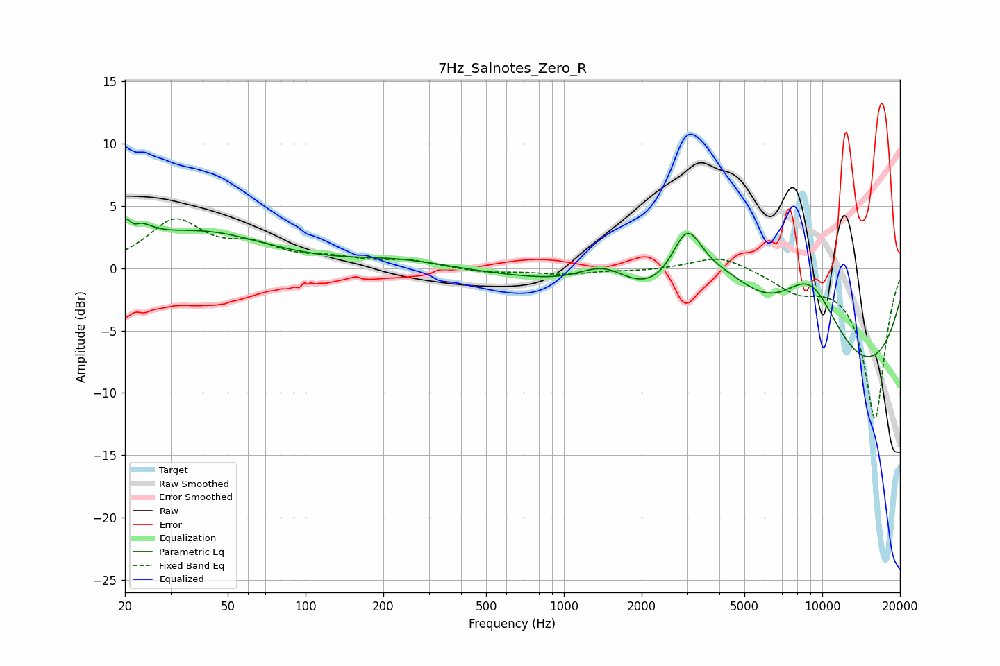

# 7Hz_Salnotes_Zero_R
See [usage instructions](https://github.com/jaakkopasanen/AutoEq#usage) for more options and info.

### Parametric EQs
Apply preamp of -4.1 dB when using parametric equalizer.

|   # | Type    |   Fc (Hz) |    Q |   Gain (dB) |
|-----|---------|-----------|------|-------------|
|   1 | Peaking |        21 | 2.9  |         3.8 |
|   2 | Peaking |        21 | 5.33 |        -1.9 |
|   3 | Peaking |        40 | 0.58 |         2.8 |
|   4 | Peaking |       232 | 0.79 |         0.7 |
|   5 | Peaking |       559 | 0.53 |        -0.1 |
|   6 | Peaking |      1435 | 1.34 |         2.3 |
|   7 | Peaking |      2995 | 2.25 |         4.9 |
|   8 | Peaking |      4166 | 0.81 |         6   |
|   9 | Peaking |      8757 | 0.21 |       -12   |
|  10 | Peaking |      8957 | 0.88 |         8.8 |

### Fixed Band EQs
When using fixed band (also called graphic) equalizer, apply preamp of **-4.1 dB** (if available) and set gains manually with these parameters.

|   # | Type    |   Fc (Hz) |    Q |   Gain (dB) |
|-----|---------|-----------|------|-------------|
|   1 | Peaking |        31 | 1.41 |         3.7 |
|   2 | Peaking |        62 | 1.41 |         1.5 |
|   3 | Peaking |       125 | 1.41 |         0.6 |
|   4 | Peaking |       250 | 1.41 |         0.6 |
|   5 | Peaking |       500 | 1.41 |        -0.3 |
|   6 | Peaking |      1000 | 1.41 |        -0.4 |
|   7 | Peaking |      2000 | 1.41 |        -0.2 |
|   8 | Peaking |      4000 | 1.41 |         1.1 |
|   9 | Peaking |      8000 | 1.41 |        -1.5 |
|  10 | Peaking |     16000 | 1.41 |       -12   |

### Graphs

