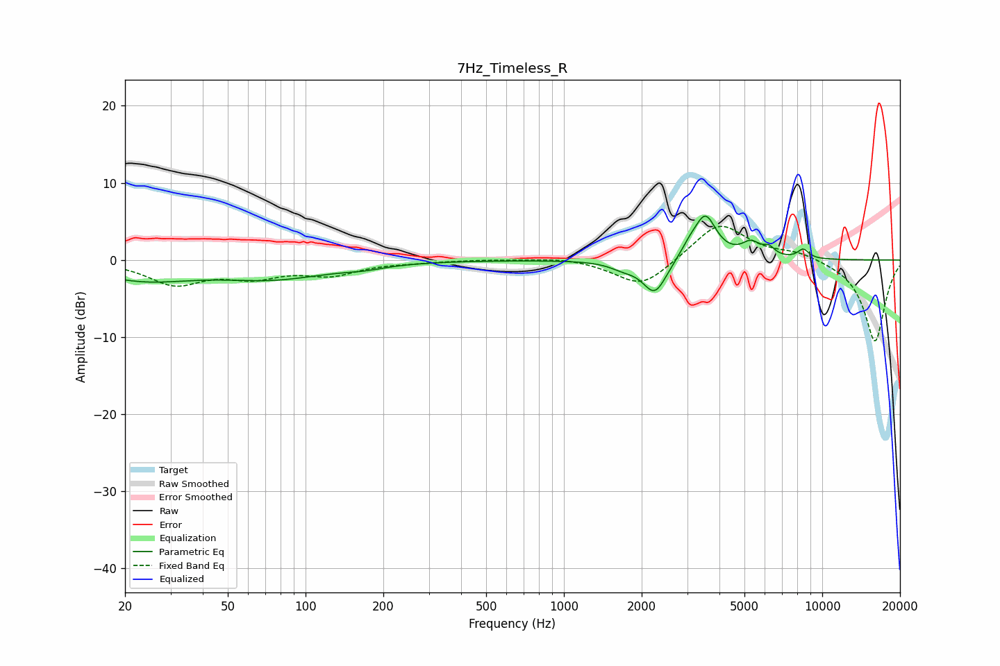

# 7Hz_Timeless_R
See [usage instructions](https://github.com/jaakkopasanen/AutoEq#usage) for more options and info.

### Parametric EQs
Apply preamp of -5.8 dB when using parametric equalizer.

|   # | Type    |   Fc (Hz) |    Q |   Gain (dB) |
|-----|---------|-----------|------|-------------|
|   1 | Peaking |        23 | 0.72 |        -2.4 |
|   2 | Peaking |        75 | 0.67 |        -2.1 |
|   3 | Peaking |       167 | 1.66 |        -0.5 |
|   4 | Peaking |      1693 | 2.77 |        -0.8 |
|   5 | Peaking |      2248 | 3.03 |        -4.4 |
|   6 | Peaking |      3056 | 3.97 |         1.2 |
|   7 | Peaking |      3529 | 3.3  |         5.6 |
|   8 | Peaking |      5304 | 3.75 |         1.8 |
|   9 | Peaking |      6224 | 6    |         1   |
|  10 | Peaking |      8443 | 6    |         1.2 |

### Fixed Band EQs
When using fixed band (also called graphic) equalizer, apply preamp of **-4.5 dB** (if available) and set gains manually with these parameters.

|   # | Type    |   Fc (Hz) |    Q |   Gain (dB) |
|-----|---------|-----------|------|-------------|
|   1 | Peaking |        31 | 1.41 |        -3   |
|   2 | Peaking |        62 | 1.41 |        -1.9 |
|   3 | Peaking |       125 | 1.41 |        -1.7 |
|   4 | Peaking |       250 | 1.41 |        -0.2 |
|   5 | Peaking |       500 | 1.41 |         0.1 |
|   6 | Peaking |      1000 | 1.41 |         0.4 |
|   7 | Peaking |      2000 | 1.41 |        -3.7 |
|   8 | Peaking |      4000 | 1.41 |         5   |
|   9 | Peaking |      8000 | 1.41 |         1   |
|  10 | Peaking |     16000 | 1.41 |       -10.6 |

### Graphs

