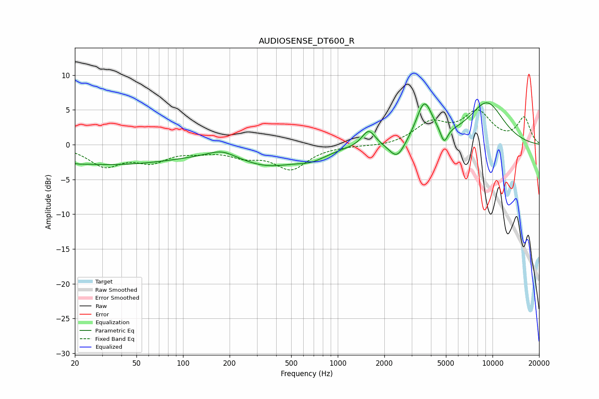

# AUDIOSENSE_DT600_R
See [usage instructions](https://github.com/jaakkopasanen/AutoEq#usage) for more options and info.

### Parametric EQs
Apply preamp of -6.1 dB when using parametric equalizer.

|   # | Type    |   Fc (Hz) |    Q |   Gain (dB) |
|-----|---------|-----------|------|-------------|
|   1 | Peaking |        21 | 3.52 |        -0.1 |
|   2 | Peaking |        33 | 0.28 |        -2.8 |
|   3 | Peaking |       178 | 1.58 |         1.1 |
|   4 | Peaking |       355 | 0.71 |        -2.7 |
|   5 | Peaking |       680 | 1.42 |        -1.2 |
|   6 | Peaking |      1583 | 3.34 |         2.3 |
|   7 | Peaking |      2419 | 2.74 |        -2.6 |
|   8 | Peaking |      3625 | 2.69 |         5.7 |
|   9 | Peaking |      4867 | 6    |        -2.2 |
|  10 | Peaking |      9174 | 1.08 |         5.9 |

### Fixed Band EQs
When using fixed band (also called graphic) equalizer, apply preamp of **-5.1 dB** (if available) and set gains manually with these parameters.

|   # | Type    |   Fc (Hz) |    Q |   Gain (dB) |
|-----|---------|-----------|------|-------------|
|   1 | Peaking |        31 | 1.41 |        -2.9 |
|   2 | Peaking |        62 | 1.41 |        -2.1 |
|   3 | Peaking |       125 | 1.41 |        -0.7 |
|   4 | Peaking |       250 | 1.41 |        -1.4 |
|   5 | Peaking |       500 | 1.41 |        -3.3 |
|   6 | Peaking |      1000 | 1.41 |        -0.1 |
|   7 | Peaking |      2000 | 1.41 |        -0.3 |
|   8 | Peaking |      4000 | 1.41 |         2.9 |
|   9 | Peaking |      8000 | 1.41 |         4.4 |
|  10 | Peaking |     16000 | 1.41 |         3.7 |

### Graphs

