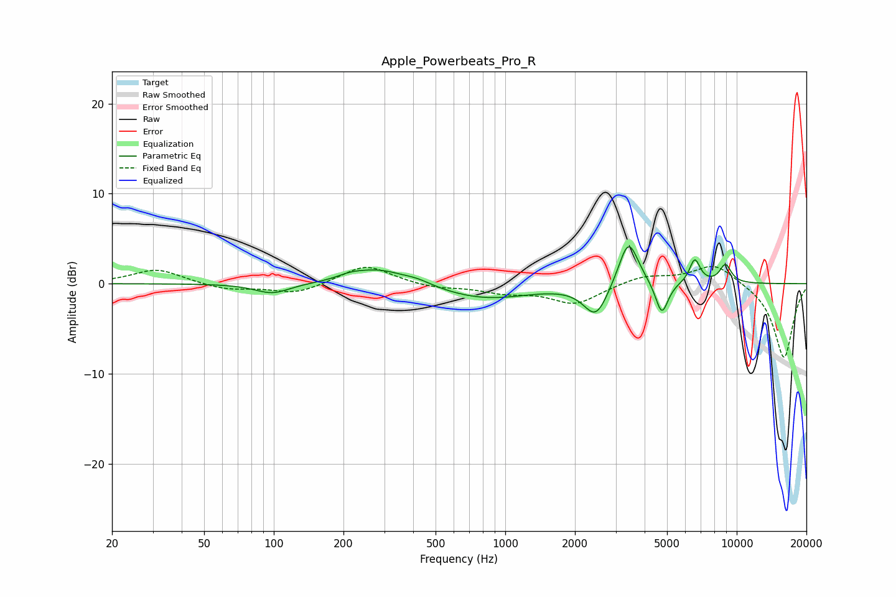

# Apple_Powerbeats_Pro_R
See [usage instructions](https://github.com/jaakkopasanen/AutoEq#usage) for more options and info.

### Parametric EQs
Apply preamp of -4.2 dB when using parametric equalizer.

|   # | Type    |   Fc (Hz) |    Q |   Gain (dB) |
|-----|---------|-----------|------|-------------|
|   1 | Peaking |        99 | 1.88 |        -1.1 |
|   2 | Peaking |       214 | 2.53 |         0.4 |
|   3 | Peaking |       284 | 1.22 |         1.7 |
|   4 | Peaking |       418 | 2.19 |         0.5 |
|   5 | Peaking |       819 | 0.72 |        -1.7 |
|   6 | Peaking |      2466 | 2.69 |        -3.6 |
|   7 | Peaking |      3405 | 3.26 |         5.4 |
|   8 | Peaking |      4747 | 5.11 |        -3.7 |
|   9 | Peaking |      6590 | 5.91 |         2.7 |
|  10 | Peaking |      8941 | 5.12 |         2.1 |

### Fixed Band EQs
When using fixed band (also called graphic) equalizer, apply preamp of **-2.0 dB** (if available) and set gains manually with these parameters.

|   # | Type    |   Fc (Hz) |    Q |   Gain (dB) |
|-----|---------|-----------|------|-------------|
|   1 | Peaking |        31 | 1.41 |         1.6 |
|   2 | Peaking |        62 | 1.41 |        -0.7 |
|   3 | Peaking |       125 | 1.41 |        -1.1 |
|   4 | Peaking |       250 | 1.41 |         2.1 |
|   5 | Peaking |       500 | 1.41 |        -0.5 |
|   6 | Peaking |      1000 | 1.41 |        -0.9 |
|   7 | Peaking |      2000 | 1.41 |        -2.2 |
|   8 | Peaking |      4000 | 1.41 |         0.9 |
|   9 | Peaking |      8000 | 1.41 |         2.3 |
|  10 | Peaking |     16000 | 1.41 |        -8.3 |

### Graphs

