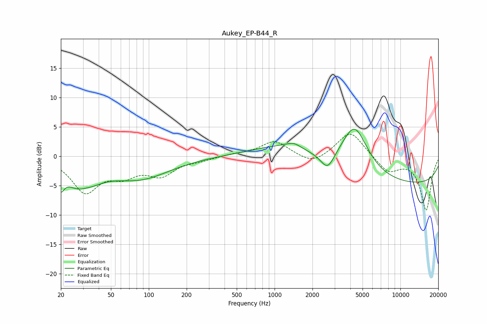

# Aukey_EP-B44_R
See [usage instructions](https://github.com/jaakkopasanen/AutoEq#usage) for more options and info.

### Parametric EQs
Apply preamp of -4.7 dB when using parametric equalizer.

|   # | Type    |   Fc (Hz) |    Q |   Gain (dB) |
|-----|---------|-----------|------|-------------|
|   1 | Peaking |        20 | 5.35 |        -6.4 |
|   2 | Peaking |        20 | 5.5  |         3.5 |
|   3 | Peaking |        29 | 1.21 |        -5.6 |
|   4 | Peaking |        31 | 2.14 |         1.4 |
|   5 | Peaking |        85 | 0.59 |        -3.6 |
|   6 | Peaking |      1297 | 0.55 |         2.5 |
|   7 | Peaking |      1410 | 2.59 |         0.8 |
|   8 | Peaking |      2633 | 2.63 |        -2.9 |
|   9 | Peaking |      4318 | 1.32 |         8.4 |
|  10 | Peaking |     10000 | 0.18 |        -4.9 |

### Fixed Band EQs
When using fixed band (also called graphic) equalizer, apply preamp of **-3.8 dB** (if available) and set gains manually with these parameters.

|   # | Type    |   Fc (Hz) |    Q |   Gain (dB) |
|-----|---------|-----------|------|-------------|
|   1 | Peaking |        31 | 1.41 |        -5.8 |
|   2 | Peaking |        62 | 1.41 |        -2.6 |
|   3 | Peaking |       125 | 1.41 |        -2.9 |
|   4 | Peaking |       250 | 1.41 |        -0.5 |
|   5 | Peaking |       500 | 1.41 |         0.3 |
|   6 | Peaking |      1000 | 1.41 |         2.6 |
|   7 | Peaking |      2000 | 1.41 |        -1.5 |
|   8 | Peaking |      4000 | 1.41 |         4.4 |
|   9 | Peaking |      8000 | 1.41 |        -2.6 |
|  10 | Peaking |     16000 | 1.41 |        -9.1 |

### Graphs

