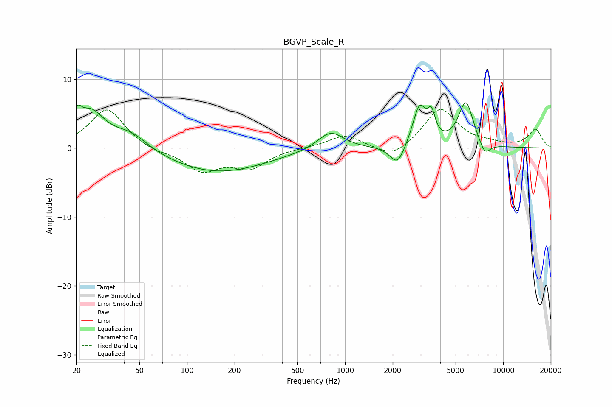

# BGVP_Scale_R
See [usage instructions](https://github.com/jaakkopasanen/AutoEq#usage) for more options and info.

### Parametric EQs
Apply preamp of -6.7 dB when using parametric equalizer.

|   # | Type    |   Fc (Hz) |    Q |   Gain (dB) |
|-----|---------|-----------|------|-------------|
|   1 | Peaking |        20 | 5.98 |         2.2 |
|   2 | Peaking |        24 | 1.53 |         5.2 |
|   3 | Peaking |        44 | 1.32 |         2.2 |
|   4 | Peaking |       156 | 0.46 |        -3.5 |
|   5 | Peaking |       808 | 1.74 |         2.7 |
|   6 | Peaking |      2146 | 3    |        -3   |
|   7 | Peaking |      2954 | 3.28 |         5.9 |
|   8 | Peaking |      3520 | 5.99 |         3.2 |
|   9 | Peaking |      5809 | 2.88 |         6.6 |
|  10 | Peaking |      7648 | 3.8  |        -2   |

### Fixed Band EQs
When using fixed band (also called graphic) equalizer, apply preamp of **-5.7 dB** (if available) and set gains manually with these parameters.

|   # | Type    |   Fc (Hz) |    Q |   Gain (dB) |
|-----|---------|-----------|------|-------------|
|   1 | Peaking |        31 | 1.41 |         5.8 |
|   2 | Peaking |        62 | 1.41 |        -0.6 |
|   3 | Peaking |       125 | 1.41 |        -3.2 |
|   4 | Peaking |       250 | 1.41 |        -2.7 |
|   5 | Peaking |       500 | 1.41 |         0   |
|   6 | Peaking |      1000 | 1.41 |         1.9 |
|   7 | Peaking |      2000 | 1.41 |        -1.8 |
|   8 | Peaking |      4000 | 1.41 |         5.7 |
|   9 | Peaking |      8000 | 1.41 |         0.4 |
|  10 | Peaking |     16000 | 1.41 |         2.7 |

### Graphs

