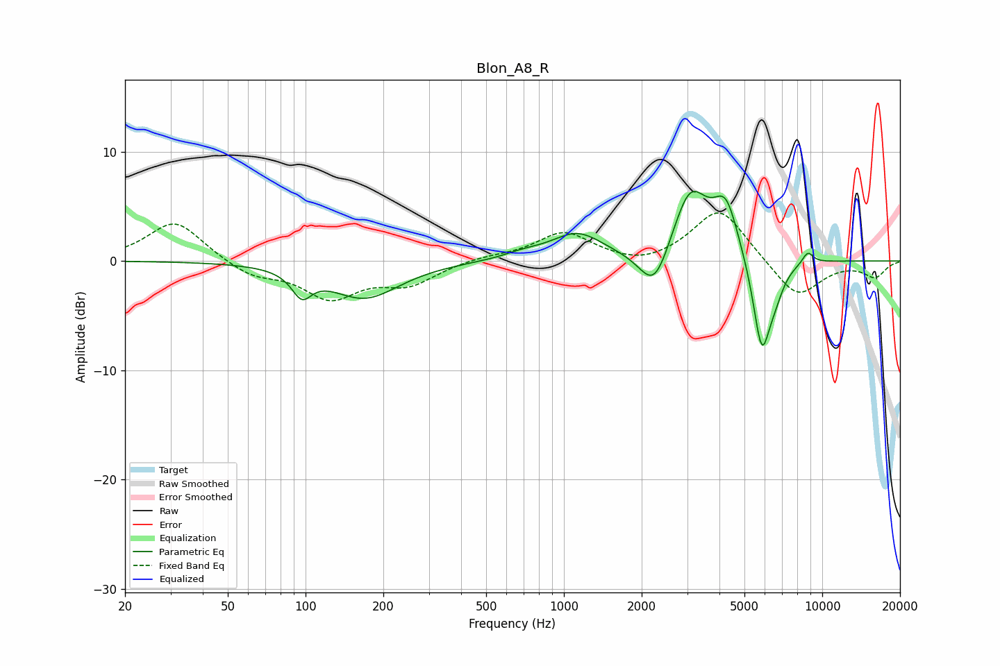

# Blon_A8_R
See [usage instructions](https://github.com/jaakkopasanen/AutoEq#usage) for more options and info.

### Parametric EQs
Apply preamp of -6.5 dB when using parametric equalizer.

|   # | Type    |   Fc (Hz) |    Q |   Gain (dB) |
|-----|---------|-----------|------|-------------|
|   1 | Peaking |        97 | 3.73 |        -2.2 |
|   2 | Peaking |       169 | 1.05 |        -3.3 |
|   3 | Peaking |       691 | 1.86 |         0.5 |
|   4 | Peaking |      1125 | 1.39 |         2.5 |
|   5 | Peaking |      2243 | 2.39 |        -4.2 |
|   6 | Peaking |      3078 | 2    |         6.5 |
|   7 | Peaking |      4239 | 2.86 |         4.7 |
|   8 | Peaking |      5833 | 3.94 |        -8.5 |
|   9 | Peaking |      6584 | 3.96 |        -1.7 |
|  10 | Peaking |      8792 | 5.97 |         1.1 |

### Fixed Band EQs
When using fixed band (also called graphic) equalizer, apply preamp of **-4.5 dB** (if available) and set gains manually with these parameters.

|   # | Type    |   Fc (Hz) |    Q |   Gain (dB) |
|-----|---------|-----------|------|-------------|
|   1 | Peaking |        31 | 1.41 |         3.7 |
|   2 | Peaking |        62 | 1.41 |        -1.3 |
|   3 | Peaking |       125 | 1.41 |        -3.2 |
|   4 | Peaking |       250 | 1.41 |        -2   |
|   5 | Peaking |       500 | 1.41 |         0.4 |
|   6 | Peaking |      1000 | 1.41 |         2.6 |
|   7 | Peaking |      2000 | 1.41 |        -0.7 |
|   8 | Peaking |      4000 | 1.41 |         4.9 |
|   9 | Peaking |      8000 | 1.41 |        -3.5 |
|  10 | Peaking |     16000 | 1.41 |        -1.4 |

### Graphs

