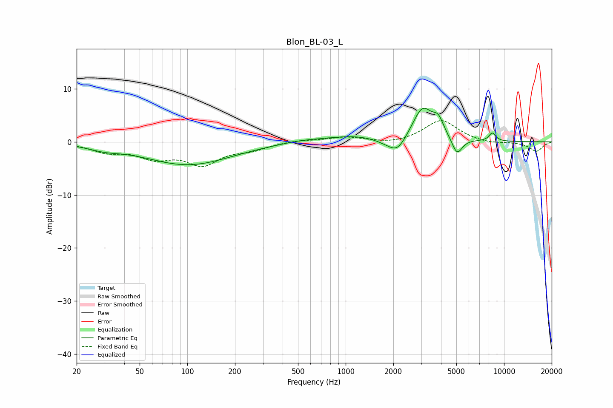

# Blon_BL-03_L
See [usage instructions](https://github.com/jaakkopasanen/AutoEq#usage) for more options and info.

### Parametric EQs
Apply preamp of -6.4 dB when using parametric equalizer.

|   # | Type    |   Fc (Hz) |    Q |   Gain (dB) |
|-----|---------|-----------|------|-------------|
|   1 | Peaking |        30 | 1.46 |        -0.8 |
|   2 | Peaking |       102 | 0.52 |        -4.3 |
|   3 | Peaking |       521 | 1.12 |         0.4 |
|   4 | Peaking |      1155 | 0.74 |         1.1 |
|   5 | Peaking |      1810 | 1.82 |        -0.8 |
|   6 | Peaking |      2128 | 2.51 |        -2.8 |
|   7 | Peaking |      3061 | 2.15 |         6.3 |
|   8 | Peaking |      3848 | 4.1  |         2.7 |
|   9 | Peaking |      5051 | 4.26 |        -3.2 |
|  10 | Peaking |      8441 | 6    |         1.6 |

### Fixed Band EQs
When using fixed band (also called graphic) equalizer, apply preamp of **-4.1 dB** (if available) and set gains manually with these parameters.

|   # | Type    |   Fc (Hz) |    Q |   Gain (dB) |
|-----|---------|-----------|------|-------------|
|   1 | Peaking |        31 | 1.41 |        -1.7 |
|   2 | Peaking |        62 | 1.41 |        -2.6 |
|   3 | Peaking |       125 | 1.41 |        -3.9 |
|   4 | Peaking |       250 | 1.41 |        -1.2 |
|   5 | Peaking |       500 | 1.41 |         0.4 |
|   6 | Peaking |      1000 | 1.41 |         0.9 |
|   7 | Peaking |      2000 | 1.41 |        -0.5 |
|   8 | Peaking |      4000 | 1.41 |         4.1 |
|   9 | Peaking |      8000 | 1.41 |        -0.4 |
|  10 | Peaking |     16000 | 1.41 |        -1.8 |

### Graphs

