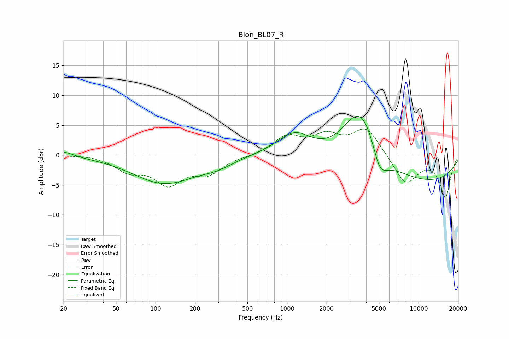

# Blon_BL07_R
See [usage instructions](https://github.com/jaakkopasanen/AutoEq#usage) for more options and info.

### Parametric EQs
Apply preamp of -6.6 dB when using parametric equalizer.

|   # | Type    |   Fc (Hz) |    Q |   Gain (dB) |
|-----|---------|-----------|------|-------------|
|   1 | Peaking |        20 | 2.19 |         0.9 |
|   2 | Peaking |       114 | 0.6  |        -4.5 |
|   3 | Peaking |       164 | 1.25 |        -0.2 |
|   4 | Peaking |       291 | 1.15 |        -1.2 |
|   5 | Peaking |      1143 | 1.04 |         4.1 |
|   6 | Peaking |      3513 | 1.05 |         4.6 |
|   7 | Peaking |      3874 | 0.94 |         7.4 |
|   8 | Peaking |      4982 | 3.51 |        -1.2 |
|   9 | Peaking |      5137 | 1.87 |        -4.4 |
|  10 | Peaking |      7950 | 0.21 |        -5.1 |

### Fixed Band EQs
When using fixed band (also called graphic) equalizer, apply preamp of **-4.5 dB** (if available) and set gains manually with these parameters.

|   # | Type    |   Fc (Hz) |    Q |   Gain (dB) |
|-----|---------|-----------|------|-------------|
|   1 | Peaking |        31 | 1.41 |         0.1 |
|   2 | Peaking |        62 | 1.41 |        -2.3 |
|   3 | Peaking |       125 | 1.41 |        -4.4 |
|   4 | Peaking |       250 | 1.41 |        -2.7 |
|   5 | Peaking |       500 | 1.41 |        -0.2 |
|   6 | Peaking |      1000 | 1.41 |         3   |
|   7 | Peaking |      2000 | 1.41 |         2.8 |
|   8 | Peaking |      4000 | 1.41 |         4.5 |
|   9 | Peaking |      8000 | 1.41 |        -4.9 |
|  10 | Peaking |     16000 | 1.41 |        -6.9 |

### Graphs

