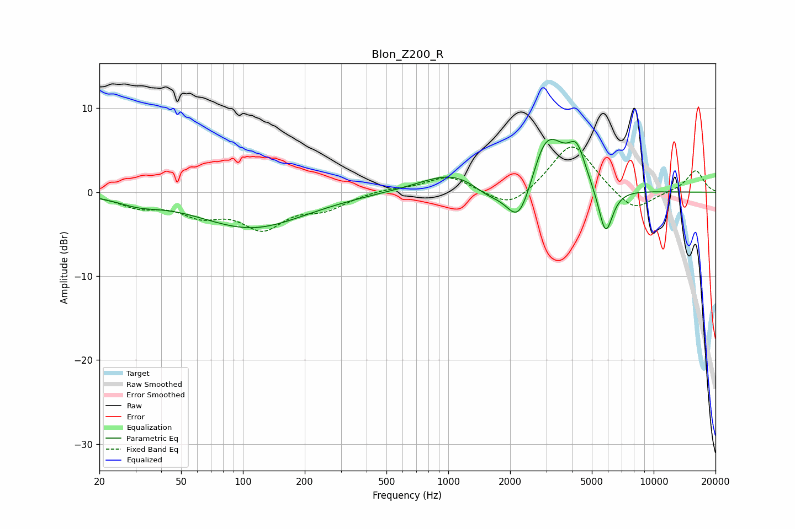

# Blon_Z200_R
See [usage instructions](https://github.com/jaakkopasanen/AutoEq#usage) for more options and info.

### Parametric EQs
Apply preamp of -6.4 dB when using parametric equalizer.

|   # | Type    |   Fc (Hz) |    Q |   Gain (dB) |
|-----|---------|-----------|------|-------------|
|   1 | Peaking |        31 | 1.39 |        -0.9 |
|   2 | Peaking |       110 | 0.55 |        -4.2 |
|   3 | Peaking |      1043 | 0.91 |         2.3 |
|   4 | Peaking |      1558 | 1.88 |        -1.3 |
|   5 | Peaking |      2190 | 2.35 |        -4.6 |
|   6 | Peaking |      2380 | 2.14 |        -0.9 |
|   7 | Peaking |      2858 | 3.05 |         1.2 |
|   8 | Peaking |      3105 | 1.65 |         6.2 |
|   9 | Peaking |      4225 | 3.36 |         3.9 |
|  10 | Peaking |      5831 | 3.88 |        -5.8 |

### Fixed Band EQs
When using fixed band (also called graphic) equalizer, apply preamp of **-5.5 dB** (if available) and set gains manually with these parameters.

|   # | Type    |   Fc (Hz) |    Q |   Gain (dB) |
|-----|---------|-----------|------|-------------|
|   1 | Peaking |        31 | 1.41 |        -1.5 |
|   2 | Peaking |        62 | 1.41 |        -2.3 |
|   3 | Peaking |       125 | 1.41 |        -3.9 |
|   4 | Peaking |       250 | 1.41 |        -1.7 |
|   5 | Peaking |       500 | 1.41 |         0.4 |
|   6 | Peaking |      1000 | 1.41 |         1.9 |
|   7 | Peaking |      2000 | 1.41 |        -2.2 |
|   8 | Peaking |      4000 | 1.41 |         6   |
|   9 | Peaking |      8000 | 1.41 |        -2.6 |
|  10 | Peaking |     16000 | 1.41 |         2.6 |

### Graphs

