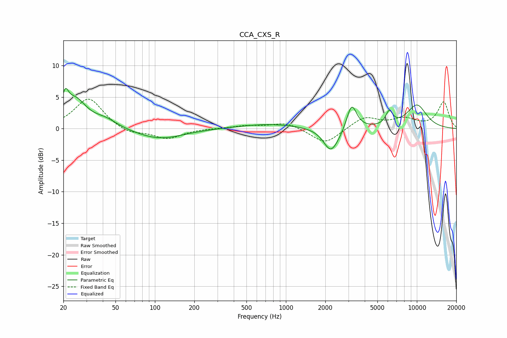

# CCA_CXS_R
See [usage instructions](https://github.com/jaakkopasanen/AutoEq#usage) for more options and info.

### Parametric EQs
Apply preamp of -6.5 dB when using parametric equalizer.

|   # | Type    |   Fc (Hz) |    Q |   Gain (dB) |
|-----|---------|-----------|------|-------------|
|   1 | Peaking |        21 | 5.89 |         2.9 |
|   2 | Peaking |        25 | 1.64 |         4.4 |
|   3 | Peaking |        42 | 1.57 |         1.2 |
|   4 | Peaking |       108 | 0.79 |        -1.7 |
|   5 | Peaking |       756 | 0.59 |         0.7 |
|   6 | Peaking |      2184 | 2.67 |        -3   |
|   7 | Peaking |      2429 | 1.95 |        -1.2 |
|   8 | Peaking |      3177 | 3.68 |         4.2 |
|   9 | Peaking |      6150 | 5.27 |         2.1 |
|  10 | Peaking |     10000 | 1.55 |         3.7 |

### Fixed Band EQs
When using fixed band (also called graphic) equalizer, apply preamp of **-4.8 dB** (if available) and set gains manually with these parameters.

|   # | Type    |   Fc (Hz) |    Q |   Gain (dB) |
|-----|---------|-----------|------|-------------|
|   1 | Peaking |        31 | 1.41 |         4.9 |
|   2 | Peaking |        62 | 1.41 |        -1   |
|   3 | Peaking |       125 | 1.41 |        -1.6 |
|   4 | Peaking |       250 | 1.41 |         0   |
|   5 | Peaking |       500 | 1.41 |         0.4 |
|   6 | Peaking |      1000 | 1.41 |         1   |
|   7 | Peaking |      2000 | 1.41 |        -2.5 |
|   8 | Peaking |      4000 | 1.41 |         1.8 |
|   9 | Peaking |      8000 | 1.41 |         1.4 |
|  10 | Peaking |     16000 | 1.41 |         4.2 |

### Graphs

