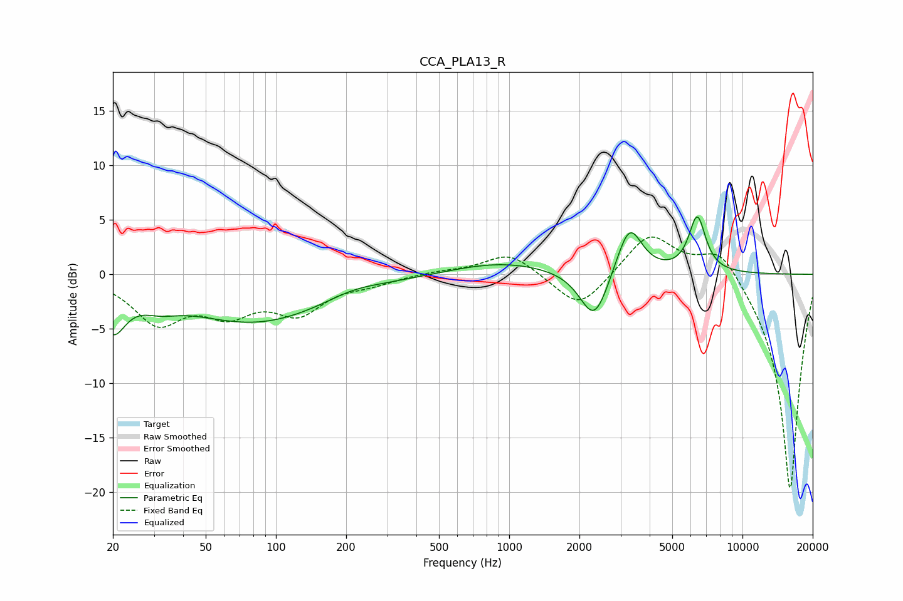

# CCA_PLA13_R
See [usage instructions](https://github.com/jaakkopasanen/AutoEq#usage) for more options and info.

### Parametric EQs
Apply preamp of -5.4 dB when using parametric equalizer.

|   # | Type    |   Fc (Hz) |    Q |   Gain (dB) |
|-----|---------|-----------|------|-------------|
|   1 | Peaking |        20 | 2.6  |        -4.1 |
|   2 | Peaking |        32 | 1.79 |        -1   |
|   3 | Peaking |        82 | 0.44 |        -4.4 |
|   4 | Peaking |       213 | 1.22 |         0.6 |
|   5 | Peaking |       928 | 0.65 |         1.2 |
|   6 | Peaking |      2302 | 2.41 |        -3.7 |
|   7 | Peaking |      2428 | 1.93 |        -1.3 |
|   8 | Peaking |      3037 | 1.88 |         0.9 |
|   9 | Peaking |      3288 | 2.71 |         4   |
|  10 | Peaking |      6400 | 3.83 |         5.1 |

### Fixed Band EQs
When using fixed band (also called graphic) equalizer, apply preamp of **-3.5 dB** (if available) and set gains manually with these parameters.

|   # | Type    |   Fc (Hz) |    Q |   Gain (dB) |
|-----|---------|-----------|------|-------------|
|   1 | Peaking |        31 | 1.41 |        -4.2 |
|   2 | Peaking |        62 | 1.41 |        -3   |
|   3 | Peaking |       125 | 1.41 |        -3.2 |
|   4 | Peaking |       250 | 1.41 |        -0.7 |
|   5 | Peaking |       500 | 1.41 |         0.3 |
|   6 | Peaking |      1000 | 1.41 |         2.1 |
|   7 | Peaking |      2000 | 1.41 |        -3.4 |
|   8 | Peaking |      4000 | 1.41 |         3.9 |
|   9 | Peaking |      8000 | 1.41 |         2.9 |
|  10 | Peaking |     16000 | 1.41 |       -20   |

### Graphs

