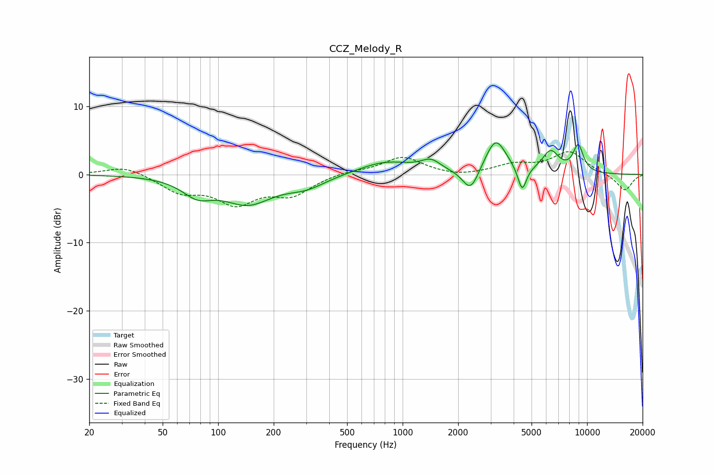

# CCZ_Melody_R
See [usage instructions](https://github.com/jaakkopasanen/AutoEq#usage) for more options and info.

### Parametric EQs
Apply preamp of -4.7 dB when using parametric equalizer.

|   # | Type    |   Fc (Hz) |    Q |   Gain (dB) |
|-----|---------|-----------|------|-------------|
|   1 | Peaking |        77 | 1.73 |        -2.4 |
|   2 | Peaking |       145 | 1.04 |        -4   |
|   3 | Peaking |       301 | 1.31 |        -1.5 |
|   4 | Peaking |       811 | 0.96 |         1.9 |
|   5 | Peaking |      1423 | 2.67 |         1.5 |
|   6 | Peaking |      2338 | 3.22 |        -3.5 |
|   7 | Peaking |      3195 | 2.46 |         5.1 |
|   8 | Peaking |      4447 | 5.99 |        -3.7 |
|   9 | Peaking |      6347 | 3.01 |         3.1 |
|  10 | Peaking |      8953 | 4.56 |         3.9 |

### Fixed Band EQs
When using fixed band (also called graphic) equalizer, apply preamp of **-3.4 dB** (if available) and set gains manually with these parameters.

|   # | Type    |   Fc (Hz) |    Q |   Gain (dB) |
|-----|---------|-----------|------|-------------|
|   1 | Peaking |        31 | 1.41 |         1.3 |
|   2 | Peaking |        62 | 1.41 |        -2.4 |
|   3 | Peaking |       125 | 1.41 |        -3.9 |
|   4 | Peaking |       250 | 1.41 |        -2.7 |
|   5 | Peaking |       500 | 1.41 |         0.5 |
|   6 | Peaking |      1000 | 1.41 |         2.6 |
|   7 | Peaking |      2000 | 1.41 |        -0.4 |
|   8 | Peaking |      4000 | 1.41 |         1.3 |
|   9 | Peaking |      8000 | 1.41 |         3.3 |
|  10 | Peaking |     16000 | 1.41 |        -2.4 |

### Graphs

