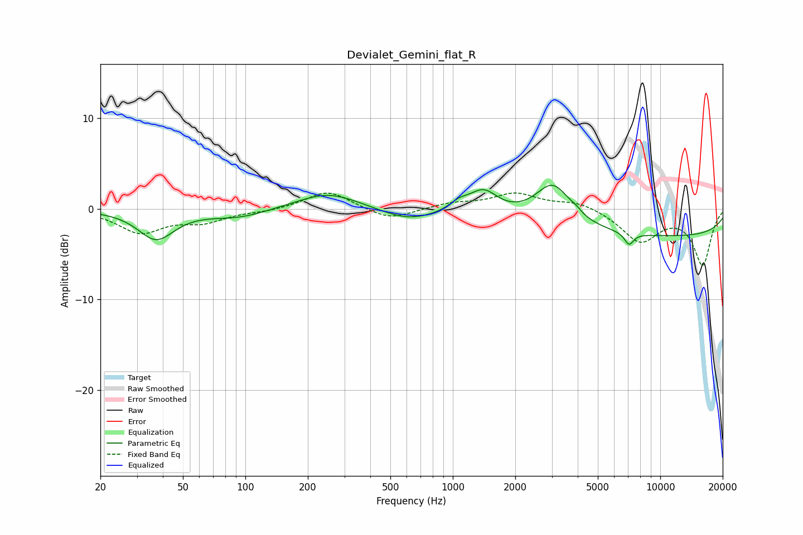

# Devialet_Gemini_flat_R
See [usage instructions](https://github.com/jaakkopasanen/AutoEq#usage) for more options and info.

### Parametric EQs
Apply preamp of -2.7 dB when using parametric equalizer.

|   # | Type    |   Fc (Hz) |    Q |   Gain (dB) |
|-----|---------|-----------|------|-------------|
|   1 | Peaking |        37 | 1.65 |        -3.3 |
|   2 | Peaking |        93 | 1.01 |        -0.9 |
|   3 | Peaking |       251 | 0.95 |         1.9 |
|   4 | Peaking |       610 | 1.06 |        -1.3 |
|   5 | Peaking |      1070 | 3.03 |         0.9 |
|   6 | Peaking |      1405 | 2.06 |         2.5 |
|   7 | Peaking |      3044 | 1.64 |         4.5 |
|   8 | Peaking |      3925 | 5.93 |         0.3 |
|   9 | Peaking |      7075 | 5.97 |        -1.3 |
|  10 | Peaking |     10000 | 0.18 |        -3   |

### Fixed Band EQs
When using fixed band (also called graphic) equalizer, apply preamp of **-1.8 dB** (if available) and set gains manually with these parameters.

|   # | Type    |   Fc (Hz) |    Q |   Gain (dB) |
|-----|---------|-----------|------|-------------|
|   1 | Peaking |        31 | 1.41 |        -2.5 |
|   2 | Peaking |        62 | 1.41 |        -1.3 |
|   3 | Peaking |       125 | 1.41 |        -0.2 |
|   4 | Peaking |       250 | 1.41 |         2   |
|   5 | Peaking |       500 | 1.41 |        -1.3 |
|   6 | Peaking |      1000 | 1.41 |         0.6 |
|   7 | Peaking |      2000 | 1.41 |         1.6 |
|   8 | Peaking |      4000 | 1.41 |         0.8 |
|   9 | Peaking |      8000 | 1.41 |        -3.5 |
|  10 | Peaking |     16000 | 1.41 |        -6.1 |

### Graphs

