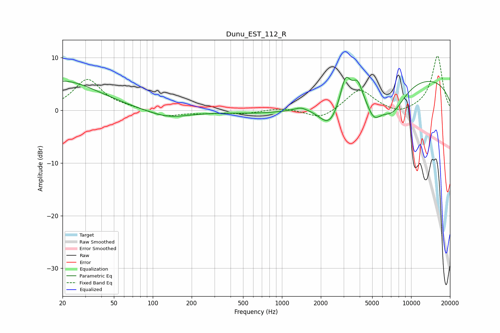

# Dunu_EST_112_R
See [usage instructions](https://github.com/jaakkopasanen/AutoEq#usage) for more options and info.

### Parametric EQs
Apply preamp of -6.4 dB when using parametric equalizer.

|   # | Type    |   Fc (Hz) |    Q |   Gain (dB) |
|-----|---------|-----------|------|-------------|
|   1 | Peaking |        20 | 0.51 |         5.6 |
|   2 | Peaking |       130 | 0.86 |        -1.5 |
|   3 | Peaking |      1004 | 0.42 |        -1.1 |
|   4 | Peaking |      1401 | 3.23 |         0.6 |
|   5 | Peaking |      2337 | 1.62 |        -5.5 |
|   6 | Peaking |      3101 | 3.7  |         5.1 |
|   7 | Peaking |      3852 | 3.94 |         3.1 |
|   8 | Peaking |      5141 | 2.34 |        -4.3 |
|   9 | Peaking |      7116 | 1.24 |        -5.9 |
|  10 | Peaking |      9012 | 0.2  |         6.8 |

### Fixed Band EQs
When using fixed band (also called graphic) equalizer, apply preamp of **-10.4 dB** (if available) and set gains manually with these parameters.

|   # | Type    |   Fc (Hz) |    Q |   Gain (dB) |
|-----|---------|-----------|------|-------------|
|   1 | Peaking |        31 | 1.41 |         5.8 |
|   2 | Peaking |        62 | 1.41 |         0.3 |
|   3 | Peaking |       125 | 1.41 |        -1.2 |
|   4 | Peaking |       250 | 1.41 |        -0.4 |
|   5 | Peaking |       500 | 1.41 |        -0.6 |
|   6 | Peaking |      1000 | 1.41 |         0.5 |
|   7 | Peaking |      2000 | 1.41 |        -1.8 |
|   8 | Peaking |      4000 | 1.41 |         4.1 |
|   9 | Peaking |      8000 | 1.41 |        -1   |
|  10 | Peaking |     16000 | 1.41 |        10.4 |

### Graphs

