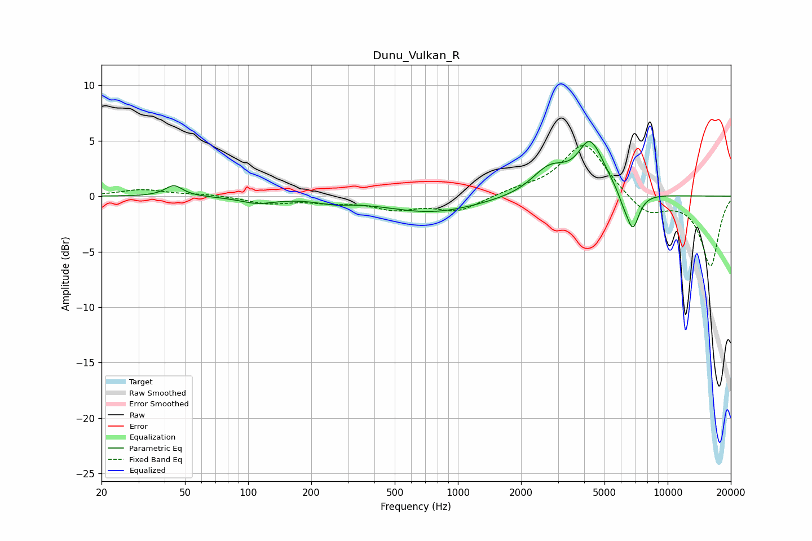

# Dunu_Vulkan_R
See [usage instructions](https://github.com/jaakkopasanen/AutoEq#usage) for more options and info.

### Parametric EQs
Apply preamp of -5.0 dB when using parametric equalizer.

|   # | Type    |   Fc (Hz) |    Q |   Gain (dB) |
|-----|---------|-----------|------|-------------|
|   1 | Peaking |        44 | 3.41 |         1   |
|   2 | Peaking |       111 | 1.72 |        -0.6 |
|   3 | Peaking |       255 | 1.79 |        -0.4 |
|   4 | Peaking |       754 | 0.63 |        -1.4 |
|   5 | Peaking |      2674 | 1.72 |         1.8 |
|   6 | Peaking |      2938 | 1.71 |         0.7 |
|   7 | Peaking |      4328 | 2.39 |         5.1 |
|   8 | Peaking |      4439 | 4.83 |        -0.6 |
|   9 | Peaking |      6142 | 5.48 |        -0.7 |
|  10 | Peaking |      6816 | 4.39 |        -3.3 |

### Fixed Band EQs
When using fixed band (also called graphic) equalizer, apply preamp of **-4.7 dB** (if available) and set gains manually with these parameters.

|   # | Type    |   Fc (Hz) |    Q |   Gain (dB) |
|-----|---------|-----------|------|-------------|
|   1 | Peaking |        31 | 1.41 |         0.6 |
|   2 | Peaking |        62 | 1.41 |         0.2 |
|   3 | Peaking |       125 | 1.41 |        -0.6 |
|   4 | Peaking |       250 | 1.41 |        -0.4 |
|   5 | Peaking |       500 | 1.41 |        -1   |
|   6 | Peaking |      1000 | 1.41 |        -1.3 |
|   7 | Peaking |      2000 | 1.41 |         0.5 |
|   8 | Peaking |      4000 | 1.41 |         4.8 |
|   9 | Peaking |      8000 | 1.41 |        -1.8 |
|  10 | Peaking |     16000 | 1.41 |        -6.3 |

### Graphs

