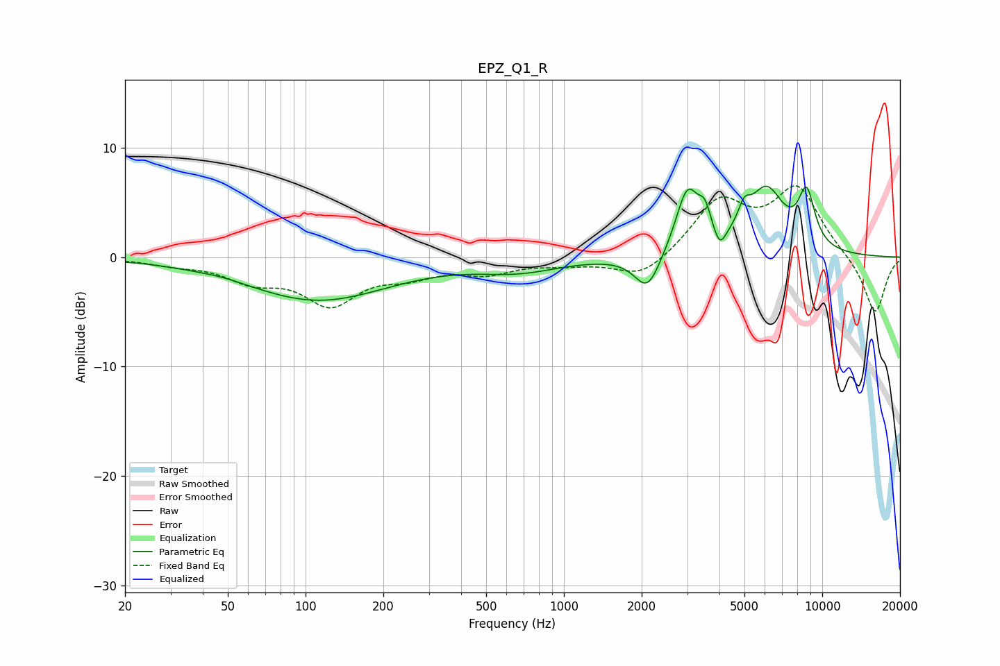

# EPZ_Q1_R
See [usage instructions](https://github.com/jaakkopasanen/AutoEq#usage) for more options and info.

### Parametric EQs
Apply preamp of -6.6 dB when using parametric equalizer.

|   # | Type    |   Fc (Hz) |    Q |   Gain (dB) |
|-----|---------|-----------|------|-------------|
|   1 | Peaking |        49 | 2.02 |         0.1 |
|   2 | Peaking |       111 | 0.51 |        -3.9 |
|   3 | Peaking |       669 | 0.89 |        -1.1 |
|   4 | Peaking |      2109 | 2.81 |        -3.4 |
|   5 | Peaking |      3009 | 3.07 |         5.9 |
|   6 | Peaking |      3518 | 5.86 |         2.1 |
|   7 | Peaking |      4011 | 6    |        -1.8 |
|   8 | Peaking |      4985 | 5.85 |         1.8 |
|   9 | Peaking |      6074 | 1.95 |         5.7 |
|  10 | Peaking |      8699 | 3.97 |         4.9 |

### Fixed Band EQs
When using fixed band (also called graphic) equalizer, apply preamp of **-6.6 dB** (if available) and set gains manually with these parameters.

|   # | Type    |   Fc (Hz) |    Q |   Gain (dB) |
|-----|---------|-----------|------|-------------|
|   1 | Peaking |        31 | 1.41 |        -0.5 |
|   2 | Peaking |        62 | 1.41 |        -1.9 |
|   3 | Peaking |       125 | 1.41 |        -4   |
|   4 | Peaking |       250 | 1.41 |        -1.3 |
|   5 | Peaking |       500 | 1.41 |        -1.3 |
|   6 | Peaking |      1000 | 1.41 |        -0.5 |
|   7 | Peaking |      2000 | 1.41 |        -2   |
|   8 | Peaking |      4000 | 1.41 |         5   |
|   9 | Peaking |      8000 | 1.41 |         6.1 |
|  10 | Peaking |     16000 | 1.41 |        -5.3 |

### Graphs

