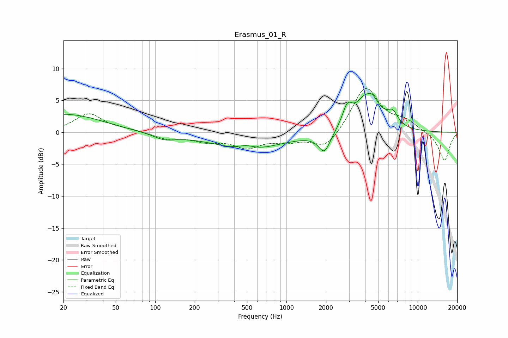

# Erasmus_01_R
See [usage instructions](https://github.com/jaakkopasanen/AutoEq#usage) for more options and info.

### Parametric EQs
Apply preamp of -6.2 dB when using parametric equalizer.

|   # | Type    |   Fc (Hz) |    Q |   Gain (dB) |
|-----|---------|-----------|------|-------------|
|   1 | Peaking |        20 | 0.49 |         2.9 |
|   2 | Peaking |       117 | 1.87 |        -0.8 |
|   3 | Peaking |       494 | 1.97 |         1   |
|   4 | Peaking |       495 | 0.18 |        -0.8 |
|   5 | Peaking |       508 | 0.75 |        -2.3 |
|   6 | Peaking |      1947 | 3.24 |        -3   |
|   7 | Peaking |      2909 | 3.64 |         3.1 |
|   8 | Peaking |      4120 | 4.56 |        -0.9 |
|   9 | Peaking |      4191 | 1.8  |         6.9 |
|  10 | Peaking |      6450 | 3.41 |         2   |

### Fixed Band EQs
When using fixed band (also called graphic) equalizer, apply preamp of **-7.0 dB** (if available) and set gains manually with these parameters.

|   # | Type    |   Fc (Hz) |    Q |   Gain (dB) |
|-----|---------|-----------|------|-------------|
|   1 | Peaking |        31 | 1.41 |         2.9 |
|   2 | Peaking |        62 | 1.41 |         0.3 |
|   3 | Peaking |       125 | 1.41 |        -1   |
|   4 | Peaking |       250 | 1.41 |        -1.2 |
|   5 | Peaking |       500 | 1.41 |        -2.1 |
|   6 | Peaking |      1000 | 1.41 |        -1.2 |
|   7 | Peaking |      2000 | 1.41 |        -2.7 |
|   8 | Peaking |      4000 | 1.41 |         7.2 |
|   9 | Peaking |      8000 | 1.41 |         1.5 |
|  10 | Peaking |     16000 | 1.41 |        -4.5 |

### Graphs

