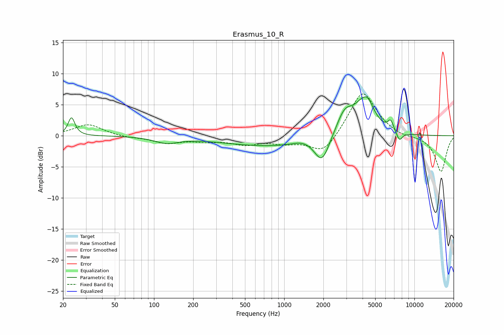

# Erasmus_10_R
See [usage instructions](https://github.com/jaakkopasanen/AutoEq#usage) for more options and info.

### Parametric EQs
Apply preamp of -6.4 dB when using parametric equalizer.

|   # | Type    |   Fc (Hz) |    Q |   Gain (dB) |
|-----|---------|-----------|------|-------------|
|   1 | Peaking |        23 | 5.54 |         2.9 |
|   2 | Peaking |       125 | 1.52 |        -1   |
|   3 | Peaking |       843 | 0.35 |        -1.7 |
|   4 | Peaking |      1403 | 1.74 |         0.7 |
|   5 | Peaking |      1952 | 2.5  |        -4.1 |
|   6 | Peaking |      2917 | 2.07 |         4   |
|   7 | Peaking |      4079 | 4.57 |        -0.9 |
|   8 | Peaking |      4186 | 2.19 |         6.6 |
|   9 | Peaking |      6573 | 5.97 |         1.7 |
|  10 | Peaking |      7669 | 5.94 |        -1.4 |

### Fixed Band EQs
When using fixed band (also called graphic) equalizer, apply preamp of **-6.8 dB** (if available) and set gains manually with these parameters.

|   # | Type    |   Fc (Hz) |    Q |   Gain (dB) |
|-----|---------|-----------|------|-------------|
|   1 | Peaking |        31 | 1.41 |         1.8 |
|   2 | Peaking |        62 | 1.41 |        -0.3 |
|   3 | Peaking |       125 | 1.41 |        -1.1 |
|   4 | Peaking |       250 | 1.41 |        -0.7 |
|   5 | Peaking |       500 | 1.41 |        -1.2 |
|   6 | Peaking |      1000 | 1.41 |        -1   |
|   7 | Peaking |      2000 | 1.41 |        -3.1 |
|   8 | Peaking |      4000 | 1.41 |         7.4 |
|   9 | Peaking |      8000 | 1.41 |        -0.4 |
|  10 | Peaking |     16000 | 1.41 |        -5.8 |

### Graphs

