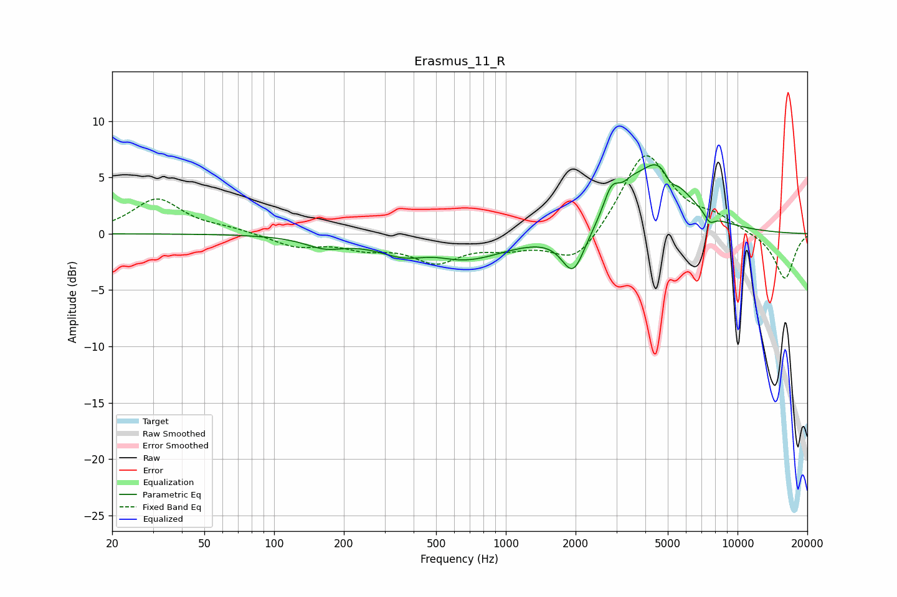

# Erasmus_11_R
See [usage instructions](https://github.com/jaakkopasanen/AutoEq#usage) for more options and info.

### Parametric EQs
Apply preamp of -6.2 dB when using parametric equalizer.

|   # | Type    |   Fc (Hz) |    Q |   Gain (dB) |
|-----|---------|-----------|------|-------------|
|   1 | Peaking |       165 | 1.68 |        -0.9 |
|   2 | Peaking |       372 | 1.22 |        -1.3 |
|   3 | Peaking |       474 | 1.36 |         0.9 |
|   4 | Peaking |       637 | 0.75 |        -2.4 |
|   5 | Peaking |      1954 | 2.83 |        -3.8 |
|   6 | Peaking |      2858 | 3.96 |         2.4 |
|   7 | Peaking |      3484 | 3.48 |         0.9 |
|   8 | Peaking |      4599 | 1.28 |         6.4 |
|   9 | Peaking |      5125 | 4.54 |        -1.3 |
|  10 | Peaking |      7580 | 6    |        -0.8 |

### Fixed Band EQs
When using fixed band (also called graphic) equalizer, apply preamp of **-7.0 dB** (if available) and set gains manually with these parameters.

|   # | Type    |   Fc (Hz) |    Q |   Gain (dB) |
|-----|---------|-----------|------|-------------|
|   1 | Peaking |        31 | 1.41 |         3.1 |
|   2 | Peaking |        62 | 1.41 |         0.4 |
|   3 | Peaking |       125 | 1.41 |        -1.1 |
|   4 | Peaking |       250 | 1.41 |        -1   |
|   5 | Peaking |       500 | 1.41 |        -2.3 |
|   6 | Peaking |      1000 | 1.41 |        -1   |
|   7 | Peaking |      2000 | 1.41 |        -2.8 |
|   8 | Peaking |      4000 | 1.41 |         7.3 |
|   9 | Peaking |      8000 | 1.41 |         1.1 |
|  10 | Peaking |     16000 | 1.41 |        -4.1 |

### Graphs

