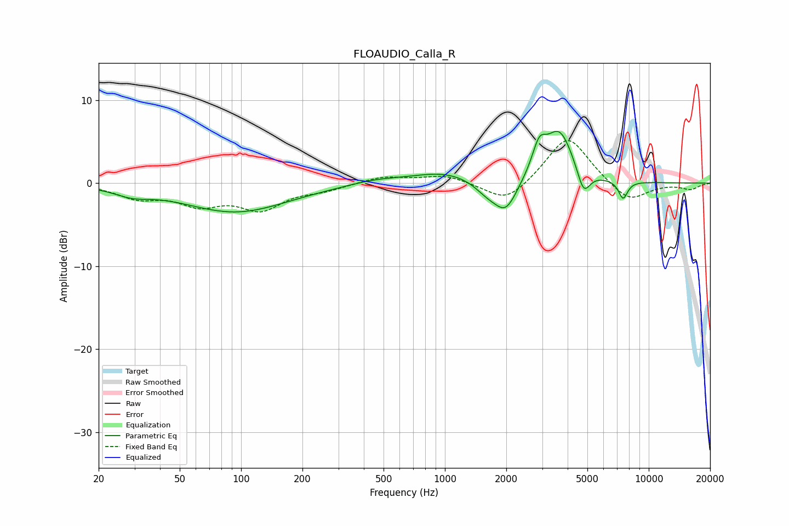

# FLOAUDIO_Calla_R
See [usage instructions](https://github.com/jaakkopasanen/AutoEq#usage) for more options and info.

### Parametric EQs
Apply preamp of -6.3 dB when using parametric equalizer.

|   # | Type    |   Fc (Hz) |    Q |   Gain (dB) |
|-----|---------|-----------|------|-------------|
|   1 | Peaking |        29 | 1.62 |        -0.9 |
|   2 | Peaking |        94 | 0.55 |        -3.5 |
|   3 | Peaking |       450 | 1.17 |         0.5 |
|   4 | Peaking |      1009 | 0.84 |         1.4 |
|   5 | Peaking |      1615 | 2.12 |        -1.5 |
|   6 | Peaking |      1993 | 2.48 |        -3.6 |
|   7 | Peaking |      2899 | 4.14 |         3.2 |
|   8 | Peaking |      3643 | 2    |         6.2 |
|   9 | Peaking |      4789 | 4.38 |        -3.1 |
|  10 | Peaking |      7486 | 6    |        -2.2 |

### Fixed Band EQs
When using fixed band (also called graphic) equalizer, apply preamp of **-5.2 dB** (if available) and set gains manually with these parameters.

|   # | Type    |   Fc (Hz) |    Q |   Gain (dB) |
|-----|---------|-----------|------|-------------|
|   1 | Peaking |        31 | 1.41 |        -1.6 |
|   2 | Peaking |        62 | 1.41 |        -2.3 |
|   3 | Peaking |       125 | 1.41 |        -2.9 |
|   4 | Peaking |       250 | 1.41 |        -0.7 |
|   5 | Peaking |       500 | 1.41 |         0.8 |
|   6 | Peaking |      1000 | 1.41 |         1   |
|   7 | Peaking |      2000 | 1.41 |        -2.6 |
|   8 | Peaking |      4000 | 1.41 |         5.9 |
|   9 | Peaking |      8000 | 1.41 |        -2.4 |
|  10 | Peaking |     16000 | 1.41 |        -0.7 |

### Graphs

