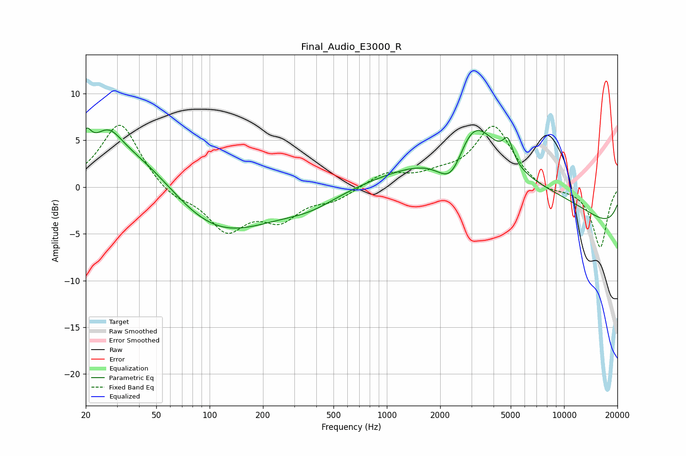

# Final_Audio_E3000_R
See [usage instructions](https://github.com/jaakkopasanen/AutoEq#usage) for more options and info.

### Parametric EQs
Apply preamp of -6.4 dB when using parametric equalizer.

|   # | Type    |   Fc (Hz) |    Q |   Gain (dB) |
|-----|---------|-----------|------|-------------|
|   1 | Peaking |        20 | 5.1  |         2.4 |
|   2 | Peaking |        27 | 1.81 |         3   |
|   3 | Peaking |        41 | 0.5  |         6   |
|   4 | Peaking |        98 | 0.43 |        -6.7 |
|   5 | Peaking |       372 | 0.91 |        -1.3 |
|   6 | Peaking |      2343 | 1.62 |        -5.6 |
|   7 | Peaking |      2983 | 1.04 |         7.9 |
|   8 | Peaking |      4819 | 5.07 |         2.2 |
|   9 | Peaking |      5036 | 0.23 |         5.8 |
|  10 | Peaking |     10000 | 0.18 |        -6.5 |

### Fixed Band EQs
When using fixed band (also called graphic) equalizer, apply preamp of **-6.7 dB** (if available) and set gains manually with these parameters.

|   # | Type    |   Fc (Hz) |    Q |   Gain (dB) |
|-----|---------|-----------|------|-------------|
|   1 | Peaking |        31 | 1.41 |         7   |
|   2 | Peaking |        62 | 1.41 |        -1.3 |
|   3 | Peaking |       125 | 1.41 |        -4.4 |
|   4 | Peaking |       250 | 1.41 |        -3   |
|   5 | Peaking |       500 | 1.41 |        -1.2 |
|   6 | Peaking |      1000 | 1.41 |         1.5 |
|   7 | Peaking |      2000 | 1.41 |         0.9 |
|   8 | Peaking |      4000 | 1.41 |         6.5 |
|   9 | Peaking |      8000 | 1.41 |        -0.7 |
|  10 | Peaking |     16000 | 1.41 |        -6.5 |

### Graphs

