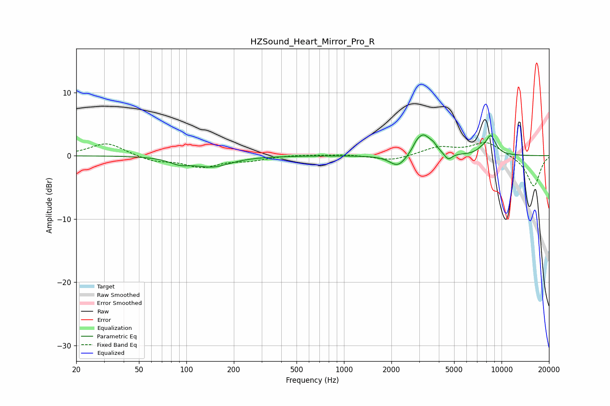

# HZSound_Heart_Mirror_Pro_R
See [usage instructions](https://github.com/jaakkopasanen/AutoEq#usage) for more options and info.

### Parametric EQs
Apply preamp of -3.4 dB when using parametric equalizer.

|   # | Type    |   Fc (Hz) |    Q |   Gain (dB) |
|-----|---------|-----------|------|-------------|
|   1 | Peaking |        91 | 2.13 |        -0.9 |
|   2 | Peaking |       147 | 1.28 |        -1.9 |
|   3 | Peaking |       149 | 1.63 |         0.3 |
|   4 | Peaking |      2201 | 2.7  |        -1.9 |
|   5 | Peaking |      2878 | 6    |         0.6 |
|   6 | Peaking |      3184 | 3.03 |         3.2 |
|   7 | Peaking |      3694 | 5.62 |         0.7 |
|   8 | Peaking |      4586 | 5.91 |        -1.1 |
|   9 | Peaking |      7440 | 4.39 |         0.5 |
|  10 | Peaking |      8536 | 4.08 |         3   |

### Fixed Band EQs
When using fixed band (also called graphic) equalizer, apply preamp of **-2.2 dB** (if available) and set gains manually with these parameters.

|   # | Type    |   Fc (Hz) |    Q |   Gain (dB) |
|-----|---------|-----------|------|-------------|
|   1 | Peaking |        31 | 1.41 |         2.1 |
|   2 | Peaking |        62 | 1.41 |        -0.9 |
|   3 | Peaking |       125 | 1.41 |        -1.7 |
|   4 | Peaking |       250 | 1.41 |        -0.7 |
|   5 | Peaking |       500 | 1.41 |         0.2 |
|   6 | Peaking |      1000 | 1.41 |         0.2 |
|   7 | Peaking |      2000 | 1.41 |        -0.8 |
|   8 | Peaking |      4000 | 1.41 |         1.3 |
|   9 | Peaking |      8000 | 1.41 |         2.1 |
|  10 | Peaking |     16000 | 1.41 |        -4.9 |

### Graphs

