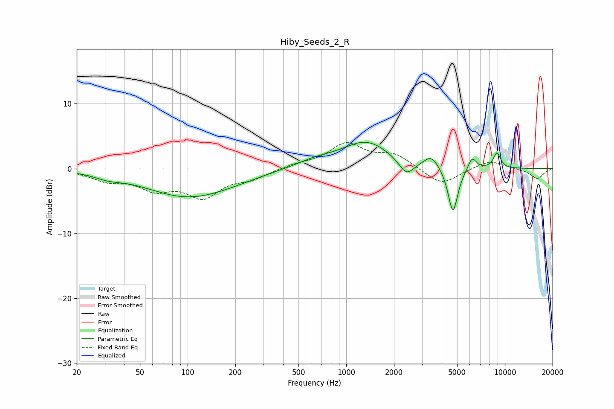

# Hiby_Seeds_2_R
See [usage instructions](https://github.com/jaakkopasanen/AutoEq#usage) for more options and info.

### Parametric EQs
Apply preamp of -4.2 dB when using parametric equalizer.

|   # | Type    |   Fc (Hz) |    Q |   Gain (dB) |
|-----|---------|-----------|------|-------------|
|   1 | Peaking |        32 | 1.75 |        -0.6 |
|   2 | Peaking |       101 | 0.53 |        -4.3 |
|   3 | Peaking |       197 | 1.02 |        -0.3 |
|   4 | Peaking |       636 | 1.11 |         1   |
|   5 | Peaking |      1338 | 0.92 |         4.1 |
|   6 | Peaking |      2395 | 2.94 |        -2.4 |
|   7 | Peaking |      3437 | 3.05 |         1.8 |
|   8 | Peaking |      4708 | 4.46 |        -7.2 |
|   9 | Peaking |      6221 | 5.2  |         2   |
|  10 | Peaking |      8922 | 5.58 |         2.4 |

### Fixed Band EQs
When using fixed band (also called graphic) equalizer, apply preamp of **-4.1 dB** (if available) and set gains manually with these parameters.

|   # | Type    |   Fc (Hz) |    Q |   Gain (dB) |
|-----|---------|-----------|------|-------------|
|   1 | Peaking |        31 | 1.41 |        -1.6 |
|   2 | Peaking |        62 | 1.41 |        -2.7 |
|   3 | Peaking |       125 | 1.41 |        -4   |
|   4 | Peaking |       250 | 1.41 |        -1.3 |
|   5 | Peaking |       500 | 1.41 |         0.6 |
|   6 | Peaking |      1000 | 1.41 |         3.7 |
|   7 | Peaking |      2000 | 1.41 |         2   |
|   8 | Peaking |      4000 | 1.41 |        -2.6 |
|   9 | Peaking |      8000 | 1.41 |         1.3 |
|  10 | Peaking |     16000 | 1.41 |        -1.6 |

### Graphs

