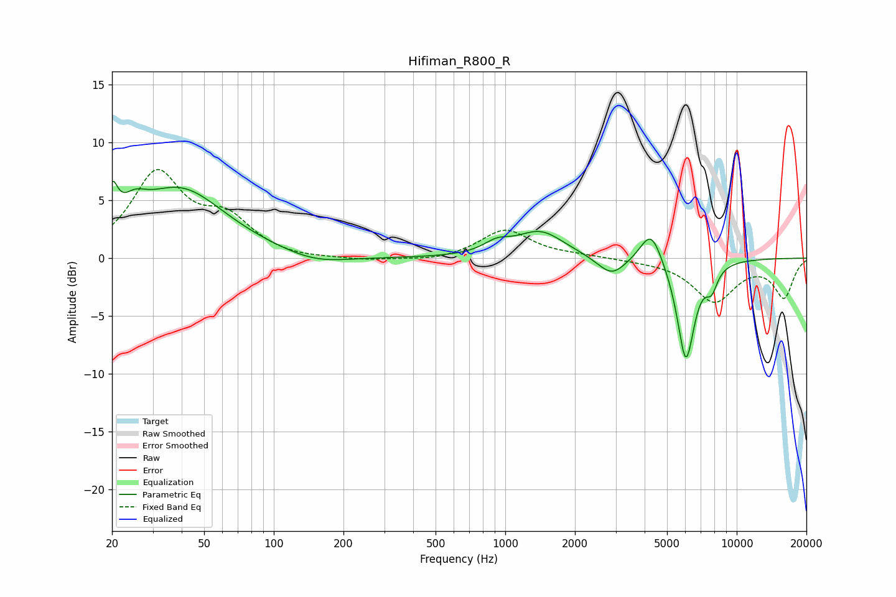

# Hifiman_R800_R
See [usage instructions](https://github.com/jaakkopasanen/AutoEq#usage) for more options and info.

### Parametric EQs
Apply preamp of -6.7 dB when using parametric equalizer.

|   # | Type    |   Fc (Hz) |    Q |   Gain (dB) |
|-----|---------|-----------|------|-------------|
|   1 | Peaking |        20 | 5.94 |         3.2 |
|   2 | Peaking |        25 | 2.68 |         1.6 |
|   3 | Peaking |        39 | 0.72 |         5.9 |
|   4 | Peaking |       152 | 1.04 |        -0.8 |
|   5 | Peaking |       919 | 2.47 |         0.9 |
|   6 | Peaking |      1418 | 1.37 |         2.3 |
|   7 | Peaking |      2882 | 2.29 |        -1.7 |
|   8 | Peaking |      4268 | 2.96 |         3   |
|   9 | Peaking |      6029 | 3.6  |        -8.9 |
|  10 | Peaking |      7787 | 5.17 |        -1.7 |

### Fixed Band EQs
When using fixed band (also called graphic) equalizer, apply preamp of **-7.8 dB** (if available) and set gains manually with these parameters.

|   # | Type    |   Fc (Hz) |    Q |   Gain (dB) |
|-----|---------|-----------|------|-------------|
|   1 | Peaking |        31 | 1.41 |         7.1 |
|   2 | Peaking |        62 | 1.41 |         3   |
|   3 | Peaking |       125 | 1.41 |        -0.2 |
|   4 | Peaking |       250 | 1.41 |        -0.2 |
|   5 | Peaking |       500 | 1.41 |        -0.3 |
|   6 | Peaking |      1000 | 1.41 |         2.5 |
|   7 | Peaking |      2000 | 1.41 |         0.2 |
|   8 | Peaking |      4000 | 1.41 |        -0.1 |
|   9 | Peaking |      8000 | 1.41 |        -3.7 |
|  10 | Peaking |     16000 | 1.41 |        -3.3 |

### Graphs

