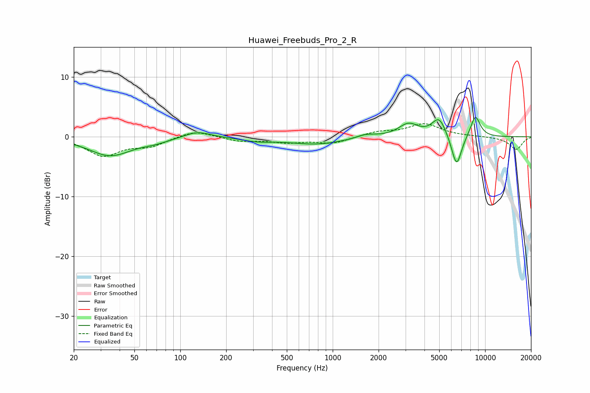

# Huawei_Freebuds_Pro_2_R
See [usage instructions](https://github.com/jaakkopasanen/AutoEq#usage) for more options and info.

### Parametric EQs
Apply preamp of -3.3 dB when using parametric equalizer.

|   # | Type    |   Fc (Hz) |    Q |   Gain (dB) |
|-----|---------|-----------|------|-------------|
|   1 | Peaking |        35 | 1.03 |        -3.1 |
|   2 | Peaking |        68 | 1.5  |        -0.6 |
|   3 | Peaking |       129 | 1.64 |         1.1 |
|   4 | Peaking |       320 | 1.41 |        -0.6 |
|   5 | Peaking |       783 | 0.78 |        -1.2 |
|   6 | Peaking |      1653 | 2.29 |         0.6 |
|   7 | Peaking |      3141 | 2.14 |         2.1 |
|   8 | Peaking |      4991 | 3.01 |         3.2 |
|   9 | Peaking |      6498 | 4.02 |        -5.5 |
|  10 | Peaking |      8630 | 3.95 |         3.6 |

### Fixed Band EQs
When using fixed band (also called graphic) equalizer, apply preamp of **-2.3 dB** (if available) and set gains manually with these parameters.

|   # | Type    |   Fc (Hz) |    Q |   Gain (dB) |
|-----|---------|-----------|------|-------------|
|   1 | Peaking |        31 | 1.41 |        -3.1 |
|   2 | Peaking |        62 | 1.41 |        -1.4 |
|   3 | Peaking |       125 | 1.41 |         1.2 |
|   4 | Peaking |       250 | 1.41 |        -0.7 |
|   5 | Peaking |       500 | 1.41 |        -0.8 |
|   6 | Peaking |      1000 | 1.41 |        -1.1 |
|   7 | Peaking |      2000 | 1.41 |         0.8 |
|   8 | Peaking |      4000 | 1.41 |         2.1 |
|   9 | Peaking |      8000 | 1.41 |         0.1 |
|  10 | Peaking |     16000 | 1.41 |        -2.1 |

### Graphs

