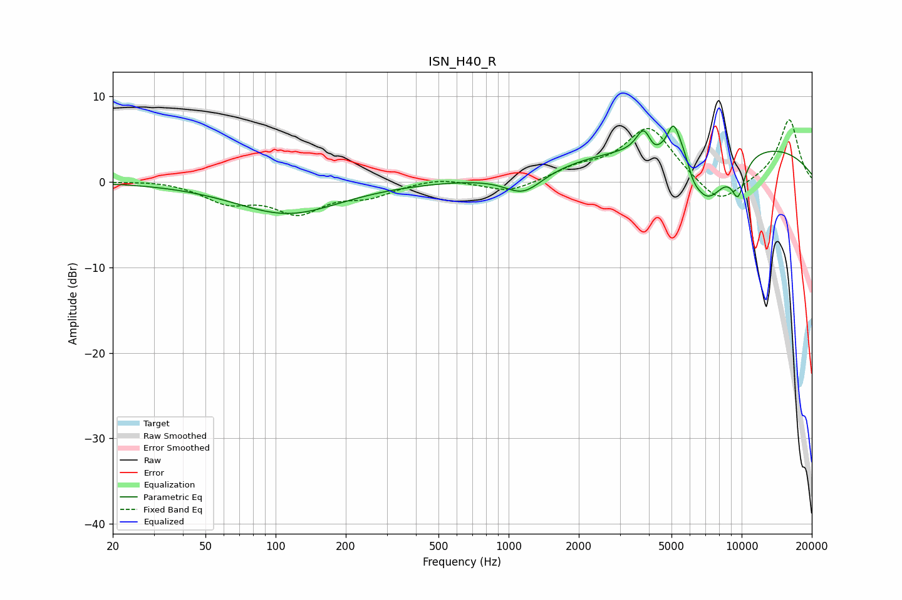

# ISN_H40_R
See [usage instructions](https://github.com/jaakkopasanen/AutoEq#usage) for more options and info.

### Parametric EQs
Apply preamp of -6.6 dB when using parametric equalizer.

|   # | Type    |   Fc (Hz) |    Q |   Gain (dB) |
|-----|---------|-----------|------|-------------|
|   1 | Peaking |       113 | 0.63 |        -3.7 |
|   2 | Peaking |      1159 | 1.71 |        -2.5 |
|   3 | Peaking |      3795 | 4.54 |         2.7 |
|   4 | Peaking |      4205 | 5.6  |        -0.7 |
|   5 | Peaking |      5097 | 5.27 |         3.4 |
|   6 | Peaking |      5738 | 3.05 |         2.6 |
|   7 | Peaking |      6136 | 4.75 |        -1.6 |
|   8 | Peaking |      7062 | 1.53 |        -6.8 |
|   9 | Peaking |      7746 | 0.2  |         4.9 |
|  10 | Peaking |      9665 | 4.3  |        -4   |

### Fixed Band EQs
When using fixed band (also called graphic) equalizer, apply preamp of **-7.3 dB** (if available) and set gains manually with these parameters.

|   # | Type    |   Fc (Hz) |    Q |   Gain (dB) |
|-----|---------|-----------|------|-------------|
|   1 | Peaking |        31 | 1.41 |         0.2 |
|   2 | Peaking |        62 | 1.41 |        -2.2 |
|   3 | Peaking |       125 | 1.41 |        -3.3 |
|   4 | Peaking |       250 | 1.41 |        -1.5 |
|   5 | Peaking |       500 | 1.41 |         0.6 |
|   6 | Peaking |      1000 | 1.41 |        -1.3 |
|   7 | Peaking |      2000 | 1.41 |         1.3 |
|   8 | Peaking |      4000 | 1.41 |         6.4 |
|   9 | Peaking |      8000 | 1.41 |        -3.1 |
|  10 | Peaking |     16000 | 1.41 |         7.4 |

### Graphs

