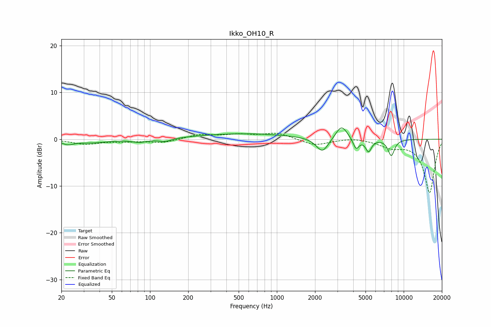

# Ikko_OH10_R
See [usage instructions](https://github.com/jaakkopasanen/AutoEq#usage) for more options and info.

### Parametric EQs
Apply preamp of -2.5 dB when using parametric equalizer.

|   # | Type    |   Fc (Hz) |    Q |   Gain (dB) |
|-----|---------|-----------|------|-------------|
|   1 | Peaking |        22 | 3.19 |        -0.8 |
|   2 | Peaking |        35 | 1.06 |        -0.7 |
|   3 | Peaking |        83 | 2.51 |        -0.6 |
|   4 | Peaking |       131 | 2.75 |        -0.7 |
|   5 | Peaking |       553 | 0.38 |         1.2 |
|   6 | Peaking |      2285 | 2.94 |        -3.1 |
|   7 | Peaking |      3232 | 3.15 |         3   |
|   8 | Peaking |      4212 | 6    |        -2.3 |
|   9 | Peaking |      5283 | 5.96 |        -2.6 |
|  10 | Peaking |      7978 | 5.1  |        -3.5 |

### Fixed Band EQs
When using fixed band (also called graphic) equalizer, apply preamp of **-1.4 dB** (if available) and set gains manually with these parameters.

|   # | Type    |   Fc (Hz) |    Q |   Gain (dB) |
|-----|---------|-----------|------|-------------|
|   1 | Peaking |        31 | 1.41 |        -1   |
|   2 | Peaking |        62 | 1.41 |        -0.4 |
|   3 | Peaking |       125 | 1.41 |        -0.8 |
|   4 | Peaking |       250 | 1.41 |         1   |
|   5 | Peaking |       500 | 1.41 |         0.8 |
|   6 | Peaking |      1000 | 1.41 |         1.3 |
|   7 | Peaking |      2000 | 1.41 |        -1.4 |
|   8 | Peaking |      4000 | 1.41 |         0.4 |
|   9 | Peaking |      8000 | 1.41 |        -1.5 |
|  10 | Peaking |     16000 | 1.41 |       -11.4 |

### Graphs

