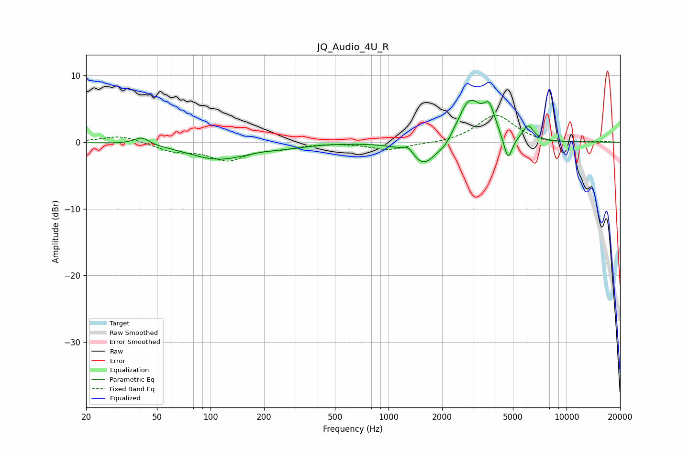

# JQ_Audio_4U_R
See [usage instructions](https://github.com/jaakkopasanen/AutoEq#usage) for more options and info.

### Parametric EQs
Apply preamp of -6.4 dB when using parametric equalizer.

|   # | Type    |   Fc (Hz) |    Q |   Gain (dB) |
|-----|---------|-----------|------|-------------|
|   1 | Peaking |        41 | 3.31 |         1.1 |
|   2 | Peaking |       110 | 0.84 |        -2.5 |
|   3 | Peaking |       268 | 1.23 |        -0.4 |
|   4 | Peaking |      1294 | 4.6  |         1.2 |
|   5 | Peaking |      1574 | 1.87 |        -3.9 |
|   6 | Peaking |      2090 | 3.51 |        -1   |
|   7 | Peaking |      2855 | 2.05 |         6.5 |
|   8 | Peaking |      3681 | 4.44 |         3.6 |
|   9 | Peaking |      4694 | 5.85 |        -3.8 |
|  10 | Peaking |      6094 | 4.61 |         2.2 |

### Fixed Band EQs
When using fixed band (also called graphic) equalizer, apply preamp of **-4.1 dB** (if available) and set gains manually with these parameters.

|   # | Type    |   Fc (Hz) |    Q |   Gain (dB) |
|-----|---------|-----------|------|-------------|
|   1 | Peaking |        31 | 1.41 |         1.1 |
|   2 | Peaking |        62 | 1.41 |        -1.2 |
|   3 | Peaking |       125 | 1.41 |        -2.5 |
|   4 | Peaking |       250 | 1.41 |        -0.7 |
|   5 | Peaking |       500 | 1.41 |         0   |
|   6 | Peaking |      1000 | 1.41 |        -1.1 |
|   7 | Peaking |      2000 | 1.41 |        -0.2 |
|   8 | Peaking |      4000 | 1.41 |         4.2 |
|   9 | Peaking |      8000 | 1.41 |        -0.3 |
|  10 | Peaking |     16000 | 1.41 |         0.1 |

### Graphs

